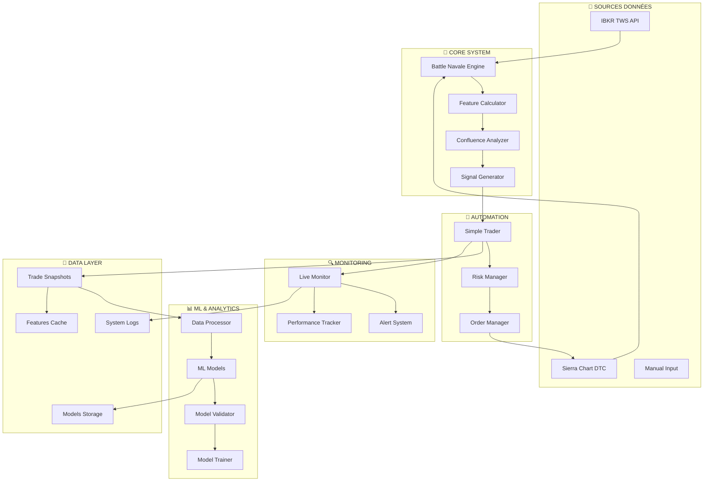
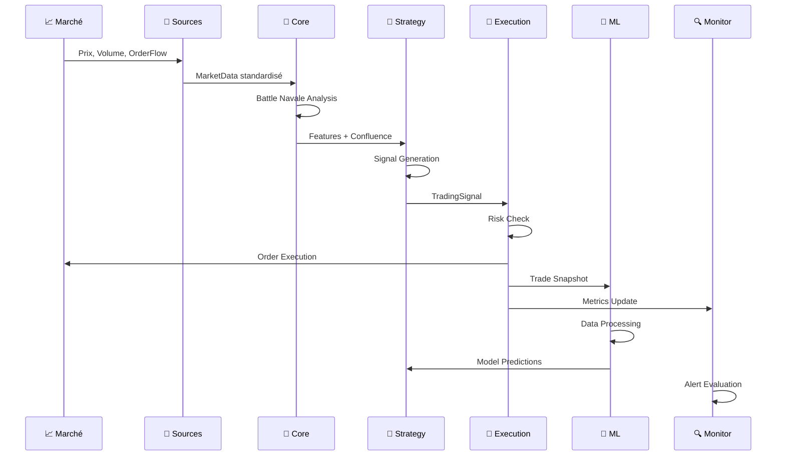
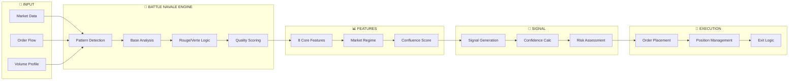
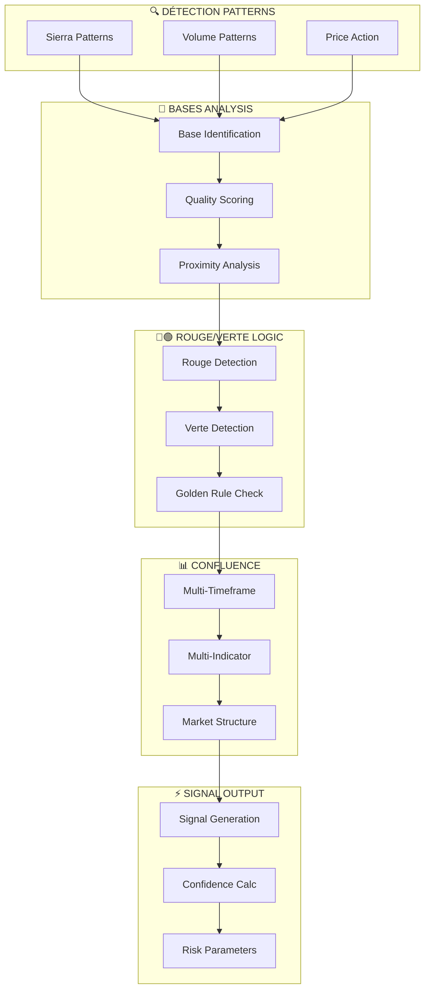
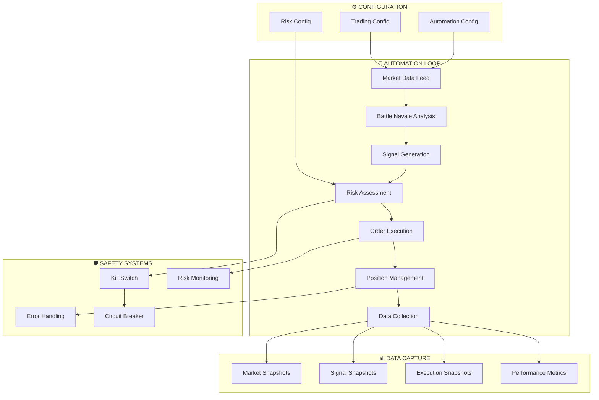
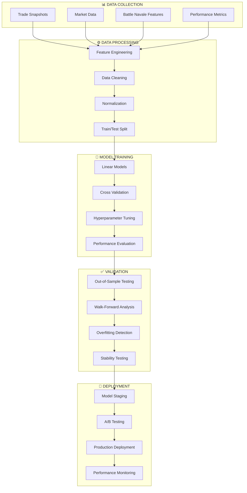
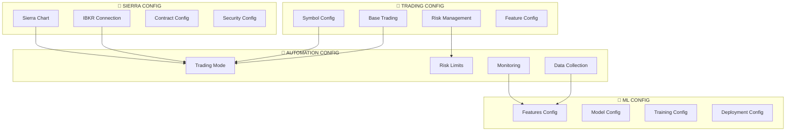

# Architecture MIA_IA_SYSTEM

**Documentation Architecture Complète - Phase 3**  
**Version: 3.0.0 - Automation & ML Integration**  
**Mise à jour: Juin 2025**

---

## 📋 Table des Matières

1. [Vue d'Ensemble](#vue-densemble)
2. [Architecture Modulaire](#architecture-modulaire)
3. [Flux de Données](#flux-de-données)
4. [Méthode Battle Navale](#méthode-battle-navale)
5. [Pipeline Automation](#pipeline-automation)
6. [Architecture ML](#architecture-ml)
7. [Sécurité & Robustesse](#sécurité--robustesse)
8. [Performance & Évolutivité](#performance--évolutivité)
9. [Configuration](#configuration)
10. [Déploiement](#déploiement)

---

## 🎯 Vue d'Ensemble

### Mission du Système

Le **MIA_IA_SYSTEM** est un système de trading automatisé conçu autour de la méthode propriétaire **Battle Navale**. Le système vise à :

- **Automatiser** la méthode Battle Navale avec précision
- **Collecter** massivement des données pour optimisation ML
- **Améliorer** progressivement les performances via Machine Learning
- **Sécuriser** l'exécution avec monitoring temps réel

### Philosophie de Conception

```
🎯 MÉTHODOLOGIE : Prouvé → Automatisé → Optimisé
🛡️ SÉCURITÉ : Safety First, Performance Second  
📊 DATA-DRIVEN : Décisions basées sur données réelles
🔄 ÉVOLUTIF : Simple → Sophistiqué progressivement
```

### Architecture Globale



---

## 🏗️ Architecture Modulaire

### Structure Complète du Projet

```
MIA_IA_SYSTEM/
├── 📁 config/                    # ⚙️ Configuration centralisée
│   ├── __init__.py              # Exports unifiés
│   ├── trading_config.py        # Config trading de base
│   ├── sierra_config.py         # Config Sierra Chart + IBKR
│   ├── automation_config.py     # Config automation complet
│   └── ml_config.py            # Config ML progressif
│
├── 📁 core/                      # 🧠 Cerveau du système
│   ├── __init__.py              # Types de base
│   ├── base_types.py            # Structures données fondamentales
│   ├── battle_navale.py         # 🎯 MÉTHODE SIGNATURE
│   ├── patterns_detector.py     # Détection patterns elite
│   ├── ibkr_connector.py        # Connecteur IBKR API
│   └── sierra_connector.py      # Connecteur Sierra Chart
│
├── 📁 features/                  # 📊 Extraction features
│   ├── __init__.py              # Exports features
│   ├── feature_calculator.py    # 8 features Battle Navale
│   ├── confluence_analyzer.py   # Analyse confluence multi-niveaux
│   └── market_regime.py         # Détection Trend/Range
│
├── 📁 strategies/                # 🎪 Stratégies de trading
│   ├── __init__.py              # Orchestration signaux
│   ├── signal_generator.py      # 🔥 CERVEAU CENTRAL
│   ├── trend_strategy.py        # Stratégie tendance
│   ├── range_strategy.py        # Stratégie range
│   └── strategy_selector.py     # Sélection intelligente
│
├── 📁 execution/                 # 🤖 Automation trading
│   ├── __init__.py              # Automation complète
│   ├── simple_trader.py         # 🚀 CORE AUTOMATION
│   ├── trade_snapshotter.py     # Capture données obsessive
│   ├── order_manager.py         # Gestion ordres multi-broker
│   └── risk_manager.py          # Gestion risques Battle Navale
│
├── 📁 ml/                        # 🧠 Machine Learning
│   ├── __init__.py              # Pipeline ML complet
│   ├── simple_model.py          # Modèles linéaires
│   ├── data_processor.py        # Préparation données ML
│   ├── model_validator.py       # Validation robuste
│   └── model_trainer.py         # Training automatisé
│
├── 📁 monitoring/                # 🔍 Surveillance système
│   ├── __init__.py              # Monitoring temps réel
│   ├── live_monitor.py          # Surveillance continue
│   ├── performance_tracker.py   # Métriques performance
│   └── alert_system.py          # Alertes intelligentes
│
├── 📁 data/                      # 💾 Stockage données
│   ├── snapshots/               # Snapshots trades détaillés
│   ├── models/                  # Modèles ML entraînés
│   ├── cache/                   # Cache features
│   └── exports/                 # Exports données
│
├── 📁 scripts/                   # 🔧 Scripts utilitaires
│   ├── __init__.py              # Utilitaires automation
│   ├── train_models.py          # Training ML CLI
│   ├── start_automation.py      # Démarrage automation
│   ├── backup_data.py           # Backup données
│   └── analyze_performance.py   # Analyse performance
│
├── 📁 tests/                     # ✅ Tests système
│   ├── test_core/               # Tests composants core
│   ├── test_automation/         # Tests automation
│   └── test_ml/                 # Tests ML
│
├── 📁 logs/                      # 📝 Journalisation
│   ├── trading/                 # Logs trading
│   ├── ml/                      # Logs ML
│   └── system/                  # Logs système
│
├── automation_main.py            # 🚀 Point d'entrée automation
├── data_collection_main.py       # 📊 Point d'entrée data collection
└── main.py                      # 🎯 Point d'entrée principal
```

### Responsabilités des Modules

#### **🧠 Core (Fondations)**
- **`base_types.py`** : Types de données fondamentaux, constantes
- **`battle_navale.py`** : Implémentation méthode signature
- **`patterns_detector.py`** : Détection patterns elite
- **Connecteurs** : Interfaces IBKR et Sierra Chart

#### **📊 Features (Extraction)**
- **`feature_calculator.py`** : 8 features Battle Navale + market structure
- **`confluence_analyzer.py`** : Analyse confluence multi-niveaux
- **`market_regime.py`** : Détection automatique régimes marché

#### **🎪 Strategies (Décision)**
- **`signal_generator.py`** : Orchestrateur central de signaux
- **Stratégies spécialisées** : Trend, Range avec logiques adaptées
- **`strategy_selector.py`** : Sélection intelligente selon contexte

#### **🤖 Execution (Action)**
- **`simple_trader.py`** : Automation complète Battle Navale
- **`trade_snapshotter.py`** : Capture obsessive données
- **Gestionnaires** : Orders multi-broker, Risk management

#### **🧠 ML (Optimisation)**
- **Pipeline complet** : Data processing → Training → Validation → Deployment
- **Modèles simples** : Linear first, complexité progressive
- **Automation** : Training continu, monitoring dégradation

#### **🔍 Monitoring (Surveillance)**
- **Temps réel** : Surveillance système, performance, erreurs
- **Alertes** : Système intelligent multi-canaux
- **Analytics** : Métriques détaillées, tendances

---

## 🔄 Flux de Données

### Pipeline Principal



### Flux Détaillé Battle Navale



### Types de Données

#### **1. MarketData (Input)**
```python
@dataclass
class MarketData:
    timestamp: pd.Timestamp
    symbol: str
    price: float
    volume: int
    bid: float
    ask: float
    order_flow: OrderFlowData
    vwap: float
    session_phase: SessionPhase
```

#### **2. BattleNavaleResult (Core)**
```python
@dataclass  
class BattleNavaleResult:
    battle_status: BattleStatus
    base_quality: BaseQuality
    rouge_sous_verte: bool
    pattern_strength: float
    confluence_score: float
    signal_confidence: float
```

#### **3. TradingSignal (Output)**
```python
@dataclass
class TradingSignal:
    signal_type: SignalType  # LONG/SHORT/NO_SIGNAL
    confidence: float
    entry_price: float
    stop_loss: float
    take_profit: float
    features: Dict[str, float]
    metadata: Dict[str, Any]
```

---

## ⚔️ Méthode Battle Navale

### Vue d'Ensemble

La **méthode Battle Navale** est le cœur du système, basée sur l'analyse des "boules vertes" et "boules rouges" avec confluence multi-niveaux.

### Architecture Battle Navale



### Composants Clés

#### **1. Pattern Detection**
- **Sierra Chart Patterns** : Détection patterns propriétaires
- **Volume Analysis** : Analyse volume et order flow
- **Price Action** : Patterns prix classiques

#### **2. Base Analysis**
- **Identification** : Détection automatique bases de qualité
- **Quality Scoring** : Note qualité 0-1 selon critères
- **Proximity** : Distance aux niveaux clés

#### **3. Rouge/Verte Logic**
- **Rouge Sous Verte** : Règle d'or implémentée
- **Pattern Strength** : Force du setup global
- **Context Analysis** : Analyse contexte marché

#### **4. Confluence Integration**
- **Multi-Timeframe** : Confluence across timeframes
- **Multi-Indicator** : Confluence indicateurs techniques
- **Market Structure** : Support/résistance, trends

### Paramètres de Configuration

```python
BATTLE_NAVALE_CONFIG = {
    'base_quality_threshold': 0.6,      # Qualité minimum base
    'confluence_threshold': 0.65,       # Confluence minimum
    'rouge_sous_verte_required': True,  # Règle d'or obligatoire
    'min_signal_confidence': 0.65,      # Confiance minimum signal
    'pattern_lookback_periods': 20,     # Périodes d'analyse
    'multi_timeframe_enabled': True     # Confluence multi-TF
}
```

---

## 🤖 Pipeline Automation

### Architecture Automation



### Modes d'Automation

#### **1. Paper Trading Mode**
```python
AutomationMode.PAPER_TRADING
- Simulation complète sans risque réel
- Validation stratégie et système
- Collection données pour ML
- Tests performance sous conditions réelles
```

#### **2. Data Collection Mode**
```python
AutomationMode.DATA_COLLECTION
- Pas d'exécution trades
- Capture massive données
- Analysis Battle Navale en continu
- Préparation datasets ML
```

#### **3. Live Trading Mode**
```python
AutomationMode.LIVE_TRADING
- Trading réel avec capital
- Sécurités maximales activées
- Monitoring continu obligatoire
- Arrêt automatique si anomalie
```

### Composants Automation

#### **SimpleBattleNavaleTrader**
```python
class SimpleBattleNavaleTrader:
    """
    CORE AUTOMATION - Execute Battle Navale automatiquement
    
    Responsabilités:
    - Loop trading principal (1-5 secondes)
    - Analyse continue Battle Navale
    - Gestion positions et risk
    - Collection données détaillées
    - Monitoring performance temps réel
    """
    
    def run_trading_session(self):
        """MAIN LOOP - Execute Battle Navale automatiquement"""
        while self.is_active:
            # 1. Collecte données marché
            market_data = self.get_market_data()
            
            # 2. Analyse Battle Navale
            signal = self.signal_generator.get_signal_now(market_data)
            
            # 3. Évaluation risque
            risk_decision = self.risk_manager.evaluate_signal(signal)
            
            # 4. Exécution si approuvé
            if risk_decision.approved:
                self.execute_signal(signal)
            
            # 5. Gestion positions
            self.manage_positions()
            
            # 6. Capture données
            self.snapshotter.capture_full_snapshot()
            
            # 7. Monitoring
            self.update_performance_metrics()
```

#### **TradeSnapshotter**
```python
class TradeSnapshotter:
    """
    CAPTURE OBSESSIVE DONNÉES pour ML
    
    Capture tout:
    - État marché complet
    - Analyse Battle Navale détaillée  
    - Features et confluence
    - Contexte exécution
    - Résultats trades
    """
    
    def capture_full_snapshot(self):
        """Capture snapshot complet pour ML"""
        return {
            'market_snapshot': self.capture_market_state(),
            'battle_navale_snapshot': self.capture_battle_analysis(),
            'features_snapshot': self.capture_features(),
            'execution_snapshot': self.capture_execution_context(),
            'performance_snapshot': self.capture_performance()
        }
```

### Configuration Automation

```python
@dataclass
class AutomationConfig:
    # Trading settings
    automation_mode: AutomationMode = AutomationMode.PAPER_TRADING
    max_positions: int = 1                    # Conservative
    position_size: float = 1.0                # Base size
    
    # Battle Navale settings
    min_signal_confidence: float = 0.65       # Seuil entrée
    confluence_required: bool = True          # Confluence obligatoire
    rouge_sous_verte_required: bool = True    # Règle d'or
    
    # Risk management
    daily_loss_limit: float = 500.0          # Stop journalier
    max_risk_per_trade: float = 100.0        # Risk par trade
    
    # Timing
    analysis_frequency_ms: int = 1000        # Analyse chaque seconde
    max_analysis_time_ms: float = 500.0      # Timeout analyse
```

---

## 🧠 Architecture ML

### Pipeline ML Complet



### Philosophie ML

#### **Simple First, Complex Later**
```
Phase 1: Linear Regression / Logistic Regression
Phase 2: Tree-based models (Random Forest, XGBoost)  
Phase 3: Neural Networks (si justifié par données)
Phase 4: Ensemble methods
```

#### **Objectifs ML**
1. **Signal Enhancement** : Améliorer qualité signaux Battle Navale
2. **Timing Optimization** : Optimiser timing entrée/sortie
3. **Risk Optimization** : Optimiser position sizing
4. **Feature Discovery** : Découvrir nouvelles features

### Features ML

#### **Battle Navale Features (8 core)**
```python
BATTLE_NAVALE_FEATURES = {
    'vwap_trend_signal': 'Signal tendance VWAP',
    'sierra_pattern_strength': 'Force patterns Sierra',
    'dow_trend_regime': 'Régime tendance Dow',
    'gamma_levels_proximity': 'Proximité niveaux gamma',
    'level_proximity': 'Proximité niveaux clés',
    'es_nq_correlation': 'Corrélation ES/NQ',
    'volume_confirmation': 'Confirmation volume',
    'options_flow_bias': 'Biais flux options'
}
```

#### **Market Structure Features**
```python
MARKET_FEATURES = {
    'market_volatility': 'Volatilité marché',
    'session_time': 'Heure session',
    'bid_ask_spread': 'Écart bid-ask',
    'recent_momentum': 'Momentum récent'
}
```

### Models Architecture

#### **SimpleLinearModel**
```python
class SimpleLinearModel:
    """
    Modèle ML simple pour Battle Navale
    
    Objectifs:
    - Prédire qualité signal (0-1)
    - Améliorer timing entrée
    - Optimiser confidence scoring
    """
    
    def predict_signal_quality(self, features: Dict[str, float]) -> float:
        """Prédiction qualité signal Battle Navale"""
        # Linear combination of features
        # Weighted by feature importance
        # Output: 0-1 quality score
```

#### **ModelTrainer**
```python
class ModelTrainer:
    """
    Pipeline training automatisé
    
    Fonctionnalités:
    - Training depuis snapshots Battle Navale
    - Validation rigoureuse
    - Déploiement automatique
    - Monitoring continu
    - Re-training automatique
    """
    
    def train_model_from_snapshots(self, days_back: int = 30):
        """Training depuis snapshots collectés"""
        # 1. Collecte snapshots
        # 2. Feature engineering  
        # 3. Training model
        # 4. Validation
        # 5. Deployment si meilleur
```

### ML Safety & Validation

#### **Validation Rigoureuse**
- **Cross-validation** : 5-fold minimum
- **Out-of-sample testing** : 20% données jamais vues
- **Walk-forward analysis** : Test temporel robuste
- **Overfitting detection** : Monitoring validation curves

#### **Production Safety**
- **Staging environment** : Test 24h avant production
- **A/B testing** : Comparaison avec baseline
- **Performance monitoring** : Surveillance continue
- **Auto-rollback** : Retour automatique si dégradation

---

## 🛡️ Sécurité & Robustesse

### Mécanismes de Sécurité

#### **1. Kill Switch System**
```python
class KillSwitch:
    """Arrêt d'urgence système"""
    
    triggers = [
        'daily_loss_exceeded',      # Perte journalière dépassée
        'system_error_critical',    # Erreur système critique
        'connection_lost',          # Perte connexion broker
        'manual_trigger',           # Déclenchement manuel
        'performance_degradation'   # Dégradation performance
    ]
```

#### **2. Risk Management Multi-Niveaux**
```python
RISK_LEVELS = {
    'trade_level': {
        'max_risk_per_trade': 100.0,
        'max_position_size': 2.0,
        'stop_loss_required': True
    },
    'daily_level': {
        'daily_loss_limit': 500.0,
        'max_trades_per_day': 10,
        'consecutive_losses_limit': 3
    },
    'system_level': {
        'max_drawdown': 10.0,
        'account_exposure_limit': 2.0,
        'emergency_stop_enabled': True
    }
}
```

#### **3. Error Handling Robuste**
```python
ERROR_HANDLING = {
    'connection_errors': 'auto_reconnect_with_backoff',
    'data_errors': 'skip_iteration_with_logging',
    'calculation_errors': 'fallback_to_manual_mode',
    'execution_errors': 'retry_with_reduced_size',
    'system_errors': 'graceful_shutdown_with_notification'
}
```

### Monitoring Continu

#### **System Health Checks**
- **Connection Status** : IBKR, Sierra Chart, Internet
- **Data Quality** : Latence, complétude, cohérence
- **Performance Metrics** : Latence calculs, memory usage
- **Trading Status** : Positions, ordres, P&L

#### **Alert System**
```python
ALERT_LEVELS = {
    'INFO': 'log_only',
    'WARNING': 'log_and_dashboard',
    'ERROR': 'log_dashboard_email',
    'CRITICAL': 'log_dashboard_email_sms_kill_switch'
}
```

### Data Integrity

#### **Validation Données**
- **Market Data** : Prix cohérents, timestamps valides
- **Features** : Valeurs dans ranges attendues
- **Signals** : Logique Battle Navale respectée
- **Execution** : Ordres exécutés conformes

#### **Backup & Recovery**
```python
BACKUP_STRATEGY = {
    'snapshots': 'real_time_to_disk',
    'configurations': 'versioned_git_backup',
    'models': 'automatic_backup_before_retrain',
    'logs': 'compressed_daily_archive',
    'recovery_time_objective': '< 5 minutes'
}
```

---

## ⚡ Performance & Évolutivité

### Targets de Performance

#### **Latence Système**
```python
PERFORMANCE_TARGETS = {
    'signal_generation': '< 5ms',      # Battle Navale analysis
    'feature_calculation': '< 10ms',   # 8 features + confluence
    'risk_assessment': '< 2ms',        # Risk check
    'order_submission': '< 50ms',      # Broker communication
    'full_loop': '< 100ms',            # Complete iteration
    'data_persistence': '< 20ms'       # Snapshot saving
}
```

#### **Throughput**
```python
THROUGHPUT_TARGETS = {
    'signals_per_second': 100,         # Signal generation capacity
    'snapshots_per_hour': 3600,       # Data collection rate
    'concurrent_symbols': 4,           # Multi-symbol support
    'daily_trades_capacity': 100       # Maximum daily trades
}
```

### Optimisations Implémentées

#### **1. Caching Intelligent**
```python
CACHING_STRATEGY = {
    'market_features': 'redis_with_ttl_1s',
    'battle_navale_results': 'memory_cache_500ms',
    'confluence_scores': 'disk_cache_hourly',
    'model_predictions': 'memory_cache_100ms'
}
```

#### **2. Calculs Optimisés**
```python
OPTIMIZATIONS = {
    'vectorized_operations': 'numpy_pandas_only',
    'lazy_evaluation': 'compute_on_demand',
    'parallel_processing': 'multiprocessing_for_ml',
    'memory_management': 'explicit_cleanup'
}
```

#### **3. Database Performance**
```python
DB_OPTIMIZATIONS = {
    'snapshots_storage': 'compressed_json_with_indexing',
    'time_series_data': 'partitioned_by_date',
    'model_storage': 'pickle_with_compression',
    'logs_storage': 'rotating_files_with_compression'
}
```

### Évolutivité

#### **Scaling Horizontal**
```python
SCALING_STRATEGY = {
    'multiple_symbols': 'separate_processes_per_symbol',
    'geographic_distribution': 'region_specific_deployments',
    'load_balancing': 'round_robin_signal_processing',
    'failover': 'active_passive_with_auto_switch'
}
```

#### **Scaling Vertical**
```python
RESOURCE_SCALING = {
    'cpu_intensive': 'battle_navale_analysis_parallel',
    'memory_intensive': 'ml_training_with_pagination',
    'io_intensive': 'async_data_collection',
    'network_intensive': 'connection_pooling'
}
```

---

## ⚙️ Configuration

### Hiérarchie Configuration



### Fichiers de Configuration

#### **1. trading_config.py**
```python
@dataclass
class TradingConfig:
    # Symboles
    primary_symbol: str = "ES"
    secondary_symbols: List[str] = field(default_factory=lambda: ["NQ"])
    
    # Risk
    max_position_size: int = 2
    daily_loss_limit: float = 500.0
    
    # Battle Navale
    min_confidence: float = 0.65
    confluence_required: bool = True
```

#### **2. automation_config.py**
```python
@dataclass
class AutomationConfig:
    # Mode
    automation_mode: AutomationMode = AutomationMode.PAPER_TRADING
    
    # Battle Navale settings
    battle_navale_min_confidence: float = 0.65
    rouge_sous_verte_required: bool = True
    
    # Performance
    analysis_frequency_ms: int = 1000
    max_analysis_time_ms: float = 500.0
```

#### **3. ml_config.py**
```python
@dataclass
class MLConfig:
    # Features
    features: BattleNavaleFeatureConfig
    
    # Model
    model_type: ModelType = ModelType.SIGNAL_CLASSIFIER
    min_accuracy: float = 0.65
    
    # Training
    min_training_samples: int = 200
    auto_retrain_enabled: bool = False
```

### Gestion Environnements

```python
ENVIRONMENTS = {
    'development': {
        'automation_mode': 'paper_trading',
        'detailed_logging': True,
        'ml_enabled': True,
        'safety_limits_relaxed': True
    },
    'staging': {
        'automation_mode': 'paper_trading',
        'ml_enabled': True,
        'monitoring_enhanced': True,
        'validation_strict': True
    },
    'production': {
        'automation_mode': 'live_trading',
        'ml_enabled': True,
        'safety_limits_strict': True,
        'monitoring_maximum': True
    }
}
```

---

## 🚀 Déploiement

### Stratégie de Déploiement

#### **Phase 1: Validation Paper Trading**
```bash
# 1. Configuration paper trading
python automation_main.py --mode paper_trading --duration 24h

# 2. Validation performance
python scripts/analyze_performance.py --paper-trading-results

# 3. Data collection pour ML
python scripts/train_models.py --data-source paper_trading
```

#### **Phase 2: Data Collection Intensive**
```bash
# 1. Mode collection pure
python automation_main.py --mode data_collection --duration 7d

# 2. Training modèles initiaux
python scripts/train_models.py --mode initial --samples 1000

# 3. Validation modèles
python scripts/validate_models.py --out-of-sample
```

#### **Phase 3: Live Trading Progressif**
```bash
# 1. Déploiement staging
python automation_main.py --mode live_trading --position-size 0.5

# 2. Monitoring intensif
python monitoring/live_monitor.py --alert-level critical

# 3. Scale progressif
# Position size: 0.5 → 1.0 → 2.0 selon performance
```

### Infrastructure Requise

#### **Hardware Minimum**
```
CPU: Intel i5 4 cores ou équivalent
RAM: 16GB (8GB système + 8GB données/cache)
Storage: 500GB SSD (données historiques + logs)
Network: Connexion stable < 10ms latence
```

#### **Software Dependencies**
```python
# Core dependencies
python = "^3.9"
pandas = "^1.5.0"
numpy = "^1.24.0"
scikit-learn = "^1.2.0"

# Trading dependencies  
ib-insync = "^0.9.85"
requests = "^2.28.0"

# ML dependencies
joblib = "^1.2.0"
matplotlib = "^3.6.0"

# System dependencies
psutil = "^5.9.0"
schedule = "^1.2.0"
```

#### **External Services**
```
✅ IBKR TWS/Gateway (paper ou live)
✅ Sierra Chart avec DTC Protocol
⚠️ Connexion Internet stable
⚠️ VPS optionnel pour 24/7
```

### Monitoring Production

#### **Dashboard Temps Réel**
```python
DASHBOARD_METRICS = {
    'system_health': ['cpu', 'memory', 'disk', 'network'],
    'trading_metrics': ['positions', 'pnl', 'signals', 'hit_rate'],
    'performance_metrics': ['latency', 'throughput', 'errors'],
    'ml_metrics': ['model_confidence', 'prediction_accuracy']
}
```

#### **Alertes Automatiques**
```python
ALERT_RULES = {
    'daily_loss_80_percent': 'WARNING',
    'daily_loss_100_percent': 'CRITICAL + KILL_SWITCH',
    'system_error_rate_5_percent': 'WARNING',
    'connection_lost_30_seconds': 'ERROR',
    'model_confidence_degraded': 'WARNING'
}
```

---

## 🎯 Conclusion

Le **MIA_IA_SYSTEM** représente une architecture complète et robuste pour l'automation de trading basée sur la méthode Battle Navale. Les principaux atouts :

### ✅ **Fondations Solides**
- Architecture modulaire et extensible
- Méthode Battle Navale préservée et optimisée
- Sécurité et robustesse intégrées dès la conception

### 🚀 **Innovation Intégrée**
- Pipeline ML complet mais progressif
- Data collection obsessive pour optimisation continue
- Monitoring et alertes intelligentes

### 🛡️ **Production Ready**
- Tests complets et validation rigoureuse
- Déploiement progressif avec sécurités
- Monitoring temps réel et alertes automatiques

### 🔄 **Évolutivité**
- Scaling horizontal et vertical supporté
- Architecture prête pour multi-symbols
- Integration future avec nouvelles technologies

---

*Documentation maintenue par l'équipe MIA_IA_SYSTEM*  
*Dernière mise à jour: Juin 2025*  
*Version: 3.0.0*