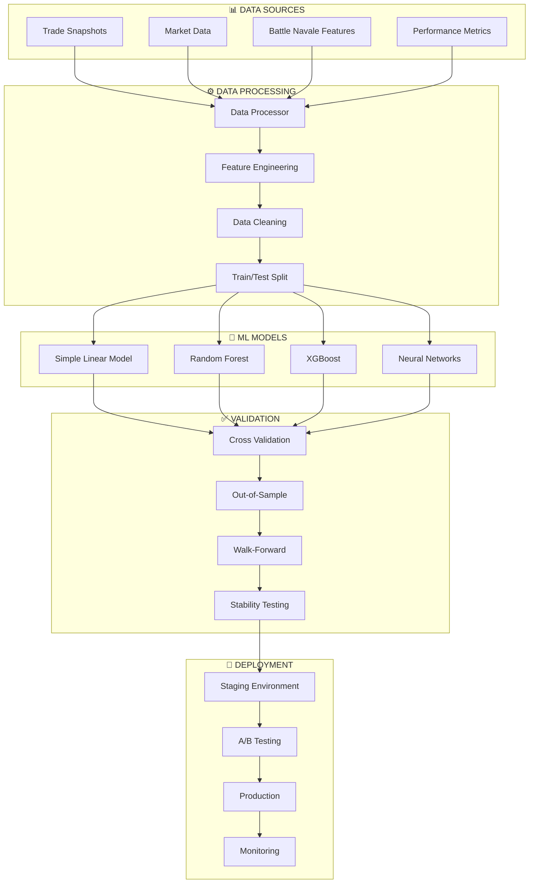

# Stratégie Machine Learning - MIA_IA_SYSTEM

**Stratégie ML Progressive pour Trading Battle Navale Automatisé**  
**Version: 3.0.0 - Production Ready**  
**Mise à jour: Juin 2025**

---

## 📋 Table des Matières

1. [Philosophie ML](#philosophie-ml)
2. [Approche Progressive](#approche-progressive)  
3. [Architecture ML](#architecture-ml)
4. [Pipeline de Données](#pipeline-de-données)
5. [Modèles & Objectifs](#modèles--objectifs)
6. [Validation & Sécurité](#validation--sécurité)
7. [Implémentation](#implémentation)
8. [Monitoring & Amélioration Continue](#monitoring--amélioration-continue)
9. [Roadmap ML](#roadmap-ml)

---

## 🎯 Philosophie ML

### Vision Stratégique

> **"Machine Learning en trading = Turbo sur voiture qui roule déjà"**

Le ML dans MIA_IA_SYSTEM n'est **PAS** destiné à créer une stratégie de trading, mais à **optimiser** une méthode déjà prouvée : **Battle Navale**.

### Principes Fondamentaux

#### 🛡️ **Safety First**
```
1. JAMAIS remplacer la logique Battle Navale
2. ML = Enhancement uniquement
3. Rollback instantané si dégradation
4. A/B testing permanent
```

#### 📊 **Data-Driven Decisions**
```
1. Minimum 500+ trades pour training
2. Validation rigoureuse obligatoire
3. Out-of-sample testing systématique
4. Performance mesurée objectivement
```

#### 🔄 **Evolution Progressive**
```
Simple → Complex, jamais l'inverse
Preuves → Implementation
Linear models → Advanced models
```

### Leçons Apprises

#### ❌ **Pourquoi ML échoue souvent en trading**
- **Données insuffisantes** : < 1000 trades = overfitting garanti
- **Edge inexistant** : ML ne crée pas d'edge magique
- **Overfitting** : Performance historique ≠ Performance future
- **Complexité prématurée** : Neural networks sans fondation
- **Régimes changeants** : Marchés évoluent, modèles deviennent obsolètes

#### ✅ **Quand ML fonctionne**
- **Edge prouvé** : Méthode manuelle profitable existante
- **Données quality** : Snapshots détaillés avec métadonnées
- **Objectif clair** : Optimiser timing/sizing, pas créer stratégie
- **Validation rigoureuse** : Testing robuste et monitoring continu
- **Simplicité d'abord** : Linear models before neural networks

---

## 🚀 Approche Progressive

### Phase 1 : Foundation Data (✅ COMPLETED)
```
Objectif : Automatiser Battle Navale + Collecter données massives
Durée : 3-6 mois
Livrable : 1000+ trades avec snapshots détaillés
```

**Réalisations :**
- ✅ Système automation `SimpleBattleNavaleTrader`
- ✅ Collection snapshots via `TradeSnapshotter`
- ✅ Monitoring temps réel `LiveMonitor`
- ✅ Pipeline données robuste

### Phase 2 : Simple ML (🔄 CURRENT)
```
Objectif : Linear models pour signal enhancement
Durée : 2-3 mois
Livrable : Amélioration 5-10% performance via ML
```

**En cours :**
- 🔄 `SimpleLinearModel` pour signal quality prediction
- 🔄 `MLDataProcessor` pour feature engineering
- 🔄 `ModelValidator` pour validation rigoureuse
- 🔄 `ModelTrainer` pour pipeline automatisé

### Phase 3 : Advanced Models (📅 FUTURE)
```
Objectif : Modèles sophistiqués si justifiés par données
Durée : 3-4 mois
Livrable : Optimisation avancée timing/sizing
```

**Prévisions :**
- 📅 Random Forest / XGBoost
- 📅 Ensemble methods
- 📅 Neural networks (si justifié)
- 📅 Reinforcement Learning (exploration)

### Phase 4 : Portfolio Intelligence (📅 FUTURE)
```
Objectif : ML multi-symbols et portfolio optimization
Durée : 6+ mois
Livrable : Système multi-marchés intelligent
```

---

## 🏗️ Architecture ML

### Vue d'Ensemble



### Composants Principaux

#### 1. **SimpleLinearModel** 
```python
Objectif : Signal quality enhancement (0-1 score)
Algorithm : Logistic/Linear Regression
Input : 8 Battle Navale features + 4 market structure
Output : Signal confidence enhancement
```

#### 2. **MLDataProcessor**
```python
Objectif : Snapshots → ML-ready datasets
Pipeline : Clean → Engineer → Split → Scale
Features : Battle Navale + Market + Technical
Export : Multiple formats (CSV, Parquet, Pickle)
```

#### 3. **ModelValidator**
```python
Objectif : Validation rigoureuse anti-overfitting
Methods : Cross-validation + Out-of-sample + Walk-forward
Metrics : Accuracy, Precision, Recall, F1, Sharpe
Safety : Overfitting detection + Stability testing
```

#### 4. **ModelTrainer**
```python
Objectif : Pipeline training automatisé
Workflow : Data → Train → Validate → Deploy → Monitor
Automation : Continuous learning + Auto-retraining
Safety : Staging → Production avec rollback
```

---

## 📊 Pipeline de Données

### Data Flow Complete

```
Trade Execution → Snapshots → Feature Engineering → ML Training → Model Enhancement → Trading Optimization
```

### 1. **Data Collection (TradeSnapshotter)**

#### Sources de données :
```python
SNAPSHOT_COMPONENTS = {
    'market_state': {
        'price': 'Prix ES en temps réel',
        'volume': 'Volume session + récent',
        'bid_ask': 'Spread et imbalance',
        'vwap': 'VWAP multi-timeframes'
    },
    'battle_navale_analysis': {
        'boules_state': 'État boules vertes/rouges',
        'confluence_score': 'Score confluence multi-level',
        'trend_regime': 'Trend vs Range detection',
        'signal_strength': 'Force signal Battle Navale'
    },
    'market_structure': {
        'gamma_levels': 'Proximité Call/Put walls',
        'vah_val_poc': 'Value area high/low/POC',
        'session_levels': 'Niveaux session précédente',
        'es_nq_correlation': 'Corrélation ES/NQ temps réel'
    },
    'execution_context': {
        'entry_reason': 'Pourquoi ce signal',
        'risk_parameters': 'Taille position + stop',
        'session_phase': 'Phase session (open/RTH/close)',
        'volatility_regime': 'Régime volatilité actuel'
    },
    'outcome_metrics': {
        'pnl_result': 'Résultat PnL réel',
        'execution_quality': 'Slippage et timing',
        'exit_reason': 'Raison sortie (TP/SL/signal)',
        'lessons_learned': 'Insights pour amélioration'
    }
}
```

### 2. **Feature Engineering (MLDataProcessor)**

#### Battle Navale Features (8 core) :
```python
BATTLE_NAVALE_FEATURES = {
    'vwap_trend_signal': 'Signal tendance VWAP (0-1)',
    'sierra_pattern_strength': 'Force patterns Sierra (0-1)', 
    'dow_trend_regime': 'Régime tendance Dow (trend/range)',
    'gamma_levels_proximity': 'Proximité niveaux gamma (0-1)',
    'level_proximity': 'Proximité niveaux clés (0-1)',
    'es_nq_correlation': 'Corrélation ES/NQ (-1 to 1)',
    'volume_confirmation': 'Confirmation volume (0-1)',
    'options_flow_bias': 'Biais flux options (-1 to 1)'
}
```

#### Market Structure Features (4 additional) :
```python
MARKET_STRUCTURE_FEATURES = {
    'market_volatility': 'VIX/ATR normalisé (0-1)',
    'session_time': 'Phase session encoded (0-1)',
    'bid_ask_spread': 'Spread normalisé (0-1)',
    'recent_momentum': 'Momentum 5-min normalisé (-1 to 1)'
}
```

#### Feature Processing Pipeline :
```python
def process_features(snapshot_data: Dict) -> pd.DataFrame:
    """
    1. Extract features from snapshots
    2. Handle missing values (forward fill + interpolation)
    3. Normalize features (0-1 scaling)
    4. Engineer interaction features
    5. Validate feature quality
    """
```

### 3. **Target Engineering**

#### Classification Targets :
```python
CLASSIFICATION_TARGETS = {
    'signal_quality': 'Good signal (1) vs Bad signal (0)',
    'profitability': 'Profitable trade (1) vs Loss (0)', 
    'signal_strength': 'Strong signal (1) vs Weak (0)'
}
```

#### Regression Targets :
```python
REGRESSION_TARGETS = {
    'pnl_prediction': 'Prédiction PnL ($)',
    'confidence_score': 'Score confiance signal (0-1)',
    'optimal_exit_timing': 'Timing optimal sortie (bars)'
}
```

---

## 🎯 Modèles & Objectifs

### Hiérarchie des Modèles

#### Level 1 : **Simple Linear Models** (Phase 2 - Current)

**SimpleLinearModel - Signal Classifier**
```python
Objectif : Prédire qualité signal Battle Navale
Algorithm : Logistic Regression
Input : 12 features (8 Battle Navale + 4 Market)
Output : Signal quality score (0-1)
Success Metric : >70% accuracy + >0.6 F1-score
```

**SimpleLinearModel - Profitability Predictor**
```python
Objectif : Prédire probabilité profit trade
Algorithm : Logistic Regression  
Input : Same 12 features
Output : Profitability probability (0-1)
Success Metric : >65% precision sur profitable trades
```

**SimpleLinearModel - Signal Strength**
```python
Objectif : Quantifier force signal
Algorithm : Linear Regression
Input : Same 12 features
Output : Signal strength score (0-1)
Success Metric : Correlation >0.5 avec PnL réel
```

#### Level 2 : **Tree-Based Models** (Phase 3 - Future)

**Random Forest Ensemble**
```python
Objectif : Capture non-linearités + feature interactions
Use Case : Si Linear models atteignent plateau performance
Success Metric : +5% improvement vs Linear baseline
```

**XGBoost Optimizer**
```python
Objectif : Optimisation advanced timing/sizing
Use Case : Données >2000 trades + validation robuste
Success Metric : +10% Sharpe ratio improvement
```

#### Level 3 : **Neural Networks** (Phase 4 - Conditional)

```python
Conditions REQUISES pour Neural Networks :
- >5000 trades clean data
- Linear models ont atteint plateau
- Justification claire non-linearité complexe
- Compute resources suffisants
- Expertise deep learning in-house
```

### Objectifs ML par Catégorie

#### 1. **Signal Enhancement** (Priority 1)
```
Baseline : Méthode Battle Navale actuelle
Target : +5-10% win rate improvement
Method : Signal quality scoring via ML
Validation : A/B testing vs baseline
```

#### 2. **Timing Optimization** (Priority 2)  
```
Baseline : Entrée immédiate sur signal
Target : Réduction 2-3 ticks slippage moyen
Method : Entry timing prediction model
Validation : Average entry price improvement
```

#### 3. **Risk Optimization** (Priority 3)
```
Baseline : Position sizing fixe
Target : +15% risk-adjusted returns
Method : Dynamic position sizing model
Validation : Sharpe ratio improvement
```

#### 4. **Feature Discovery** (Priority 4)
```
Baseline : 12 features actuelles
Target : Découvrir 3-5 nouvelles features significatives  
Method : Feature importance analysis + correlation studies
Validation : Feature ablation studies
```

---

## ✅ Validation & Sécurité

### Validation Framework

#### 1. **Cross-Validation Protocol**
```python
METHOD = "TimeSeriesSplit"  # Respecte temporalité
N_SPLITS = 5               # 5-fold minimum
WALK_FORWARD = True        # Walk-forward analysis
EMBARGO = 24               # 24h embargo entre train/test
```

#### 2. **Out-of-Sample Testing**
```python
TEST_SIZE = 0.2           # 20% données jamais vues
VALIDATION_SIZE = 0.1     # 10% pour hyperparameters
TEMPORAL_SPLIT = True     # Split temporel strict
MIN_TEST_TRADES = 200     # Minimum trades pour test valide
```

#### 3. **Overfitting Detection**
```python
OVERFITTING_THRESHOLDS = {
    'train_test_gap': 0.1,      # Max 10% écart train/test
    'validation_curve': 'stable', # Courbe validation stable
    'feature_stability': 0.8,    # Features stables >80%
    'cross_val_std': 0.05      # Std cross-val <5%
}
```

#### 4. **Model Stability Testing**
```python
STABILITY_TESTS = [
    'bootstrap_sampling',        # Robustesse échantillonnage
    'feature_permutation',       # Stabilité features
    'temporal_consistency',      # Consistance temporelle
    'regime_change_resistance'   # Résistance changements régime
]
```

### Safety Mechanisms

#### 1. **Staging Environment**
```python
STAGING_REQUIREMENTS = {
    'duration': '24h minimum',          # Test 24h minimum
    'trades_threshold': 50,             # Min 50 trades test
    'performance_vs_baseline': '>= 0%', # Au moins égale baseline
    'max_drawdown': '<= baseline * 1.2' # Drawdown contrôlé
}
```

#### 2. **A/B Testing Framework**
```python
AB_TEST_CONFIG = {
    'allocation': '50/50',              # 50% ML / 50% baseline
    'min_duration': '1 week',           # Durée minimum test
    'success_criteria': {
        'win_rate': '+3% minimum',
        'sharpe_ratio': '+0.1 minimum',
        'max_drawdown': 'no degradation'
    }
}
```

#### 3. **Performance Monitoring**
```python
MONITORING_ALERTS = {
    'model_degradation': {
        'accuracy_drop': '> 5%',        # Baisse accuracy >5%
        'precision_drop': '> 10%',      # Baisse precision >10%
        'prediction_drift': 'detected'   # Drift prédictions détecté
    },
    'auto_actions': {
        'rollback_threshold': '15% degradation',
        'retrain_threshold': '10% degradation',
        'alert_threshold': '5% degradation'
    }
}
```

#### 4. **Emergency Protocols**
```python
EMERGENCY_PROCEDURES = {
    'immediate_rollback': [
        'accuracy < 50%',               # Accuracy catastrophique
        'loss_streak > 10',             # Série pertes >10
        'daily_loss > 2x limit'         # Perte >2x limite journalière
    ],
    'gradual_rollback': [
        'performance_decline_sustained', # Déclin soutenu 3 jours
        'model_instability_detected'    # Instabilité détectée
    ]
}
```

---

## 🛠️ Implémentation

### Code Architecture

#### 1. **SimpleLinearModel Implementation**
```python
# ml/simple_model.py
class SimpleLinearModel:
    """ML model simple pour Battle Navale enhancement"""
    
    def __init__(self, model_type: ModelType):
        self.model_type = model_type
        self.model = LogisticRegression()  # or LinearRegression
        self.scaler = StandardScaler()
        self.status = ModelStatus.UNTRAINED
    
    def train_on_snapshots(self, data: pd.DataFrame) -> TrainingResult:
        """Entraînement sur snapshots Battle Navale"""
        # 1. Feature engineering
        features = self._engineer_features(data)
        targets = self._engineer_targets(data)
        
        # 2. Train/test split
        X_train, X_test, y_train, y_test = train_test_split(
            features, targets, test_size=0.2, stratify=targets
        )
        
        # 3. Training
        X_train_scaled = self.scaler.fit_transform(X_train)
        self.model.fit(X_train_scaled, y_train)
        
        # 4. Validation
        performance = self._validate_model(X_test, y_test)
        
        return TrainingResult(
            success=True,
            model_performance=performance,
            training_samples=len(X_train)
        )
    
    def predict_signal_quality(self, features: Dict) -> float:
        """Prédiction qualité signal en temps réel"""
        if self.status != ModelStatus.PRODUCTION:
            return 0.5  # Default neutral score
            
        feature_vector = self._format_features(features)
        scaled_features = self.scaler.transform([feature_vector])
        
        if self.model_type == ModelType.SIGNAL_CLASSIFIER:
            return self.model.predict_proba(scaled_features)[0][1]
        else:
            return np.clip(self.model.predict(scaled_features)[0], 0, 1)
```

#### 2. **MLDataProcessor Implementation** 
```python
# ml/data_processor.py
class MLDataProcessor:
    """Processeur données ML pour Battle Navale"""
    
    def process_snapshots(self, snapshot_files: List[str]) -> ProcessedDataset:
        """Pipeline complet snapshots → ML dataset"""
        
        # 1. Load and combine snapshots
        raw_data = self._load_snapshots(snapshot_files)
        
        # 2. Data cleaning
        clean_data = self._clean_data(raw_data)
        
        # 3. Feature engineering
        features = self._engineer_battle_navale_features(clean_data)
        
        # 4. Target engineering
        targets = self._engineer_targets(clean_data)
        
        # 5. Train/test split
        return self._create_processed_dataset(features, targets)
    
    def _engineer_battle_navale_features(self, data: pd.DataFrame) -> pd.DataFrame:
        """Feature engineering spécifique Battle Navale"""
        features = pd.DataFrame()
        
        # Core Battle Navale features
        features['vwap_trend_signal'] = self._compute_vwap_trend_signal(data)
        features['sierra_pattern_strength'] = self._compute_sierra_patterns(data)
        features['dow_trend_regime'] = self._compute_dow_trend_regime(data)
        features['gamma_levels_proximity'] = self._compute_gamma_proximity(data)
        features['level_proximity'] = self._compute_level_proximity(data)
        features['es_nq_correlation'] = self._compute_es_nq_correlation(data)
        features['volume_confirmation'] = self._compute_volume_confirmation(data)
        features['options_flow_bias'] = self._compute_options_flow_bias(data)
        
        # Market structure features
        features['market_volatility'] = self._compute_market_volatility(data)
        features['session_time'] = self._compute_session_time(data)
        features['bid_ask_spread'] = self._compute_bid_ask_spread(data)
        features['recent_momentum'] = self._compute_recent_momentum(data)
        
        return features
```

#### 3. **ModelTrainer Implementation**
```python
# ml/model_trainer.py
class ModelTrainer:
    """Pipeline training automatisé"""
    
    def train_model_from_snapshots(self, days_back: int = 30) -> TrainingSession:
        """Training complet depuis snapshots collectés"""
        
        session = TrainingSession()
        session.start_training()
        
        try:
            # 1. Collect snapshots
            snapshots = self._collect_recent_snapshots(days_back)
            
            # 2. Process data
            dataset = self.data_processor.process_snapshots(snapshots)
            
            # 3. Train model
            model = SimpleLinearModel(ModelType.SIGNAL_CLASSIFIER)
            result = model.train_on_snapshots(dataset.to_dataframe())
            
            # 4. Rigorous validation
            validation_report = self.validator.validate_model(
                model, dataset, ValidationLevel.RIGOROUS
            )
            
            # 5. Deploy if successful
            if validation_report.overall_score > 0.7:
                self._deploy_to_staging(model, validation_report)
                session.complete_success(model, validation_report)
            else:
                session.complete_failure("Model validation failed")
                
        except Exception as e:
            session.complete_failure(str(e))
            
        return session
```

### Integration avec Système Existant

#### 1. **Integration avec SimpleBattleNavaleTrader**
```python
# execution/simple_trader.py (modification)
class SimpleBattleNavaleTrader:
    def __init__(self):
        # ... existing code ...
        self.ml_enhancement_enabled = False
        self.ml_model = None
        
    def enable_ml_enhancement(self, model: SimpleLinearModel):
        """Activation enhancement ML"""
        self.ml_enhancement_enabled = True
        self.ml_model = model
        logger.info("ML enhancement activé")
    
    def _enhance_signal_with_ml(self, signal: TradingSignal) -> TradingSignal:
        """Enhancement signal via ML"""
        if not self.ml_enhancement_enabled:
            return signal
            
        # Extract features for ML
        features = self._extract_current_features()
        
        # Get ML prediction
        ml_confidence = self.ml_model.predict_signal_quality(features)
        
        # Enhance signal confidence
        enhanced_signal = signal.copy()
        enhanced_signal.confidence = (signal.confidence + ml_confidence) / 2
        enhanced_signal.metadata['ml_confidence'] = ml_confidence
        enhanced_signal.metadata['ml_enhanced'] = True
        
        return enhanced_signal
```

#### 2. **Integration avec SignalGenerator**
```python
# strategies/signal_generator.py (modification)
class SignalGenerator:
    def generate_signals(self, market_data: MarketData) -> List[TradingSignal]:
        # ... existing Battle Navale logic ...
        signals = self._generate_battle_navale_signals(market_data)
        
        # ML enhancement if enabled
        if self.ml_enhancement_enabled:
            enhanced_signals = []
            for signal in signals:
                enhanced_signal = self._enhance_with_ml(signal, market_data)
                enhanced_signals.append(enhanced_signal)
            return enhanced_signals
            
        return signals
```

---

## 📈 Monitoring & Amélioration Continue

### Real-Time Monitoring

#### 1. **Model Performance Tracking**
```python
# monitoring/ml_monitor.py
class MLPerformanceMonitor:
    """Monitoring performance modèles ML en temps réel"""
    
    def track_prediction_accuracy(self, 
                                 prediction: float, 
                                 actual_outcome: float,
                                 trade_metadata: Dict):
        """Track accuracy prédictions vs résultats réels"""
        
        accuracy = self._calculate_prediction_accuracy(prediction, actual_outcome)
        
        # Store in performance database
        self.performance_db.record_prediction(
            timestamp=datetime.now(),
            prediction=prediction,
            actual=actual_outcome,
            accuracy=accuracy,
            metadata=trade_metadata
        )
        
        # Check for degradation
        if self._detect_performance_degradation():
            self._trigger_degradation_alert()
```

#### 2. **Feature Drift Detection**
```python
def monitor_feature_drift(self, current_features: Dict, 
                         reference_features: Dict) -> float:
    """Détection drift features vs référence training"""
    
    drift_scores = {}
    for feature_name, current_value in current_features.items():
        reference_value = reference_features.get(feature_name, current_value)
        drift_score = abs(current_value - reference_value) / reference_value
        drift_scores[feature_name] = drift_score
    
    overall_drift = np.mean(list(drift_scores.values()))
    
    if overall_drift > self.drift_threshold:
        self._trigger_drift_alert(drift_scores)
        
    return overall_drift
```

### Continuous Learning Pipeline

#### 1. **Automated Retraining**
```python
# ml/continuous_learning.py
class ContinuousLearningManager:
    """Gestionnaire apprentissage continu"""
    
    def schedule_retraining(self):
        """Planning re-entraînement automatique"""
        
        # Daily data quality check
        schedule.every().day.at("02:00").do(self._check_data_quality)
        
        # Weekly model performance review
        schedule.every().week.at("03:00").do(self._review_model_performance)
        
        # Monthly full retraining if needed
        schedule.every(4).weeks.at("04:00").do(self._consider_full_retraining)
    
    def _consider_full_retraining(self):
        """Évaluation besoin re-entraînement complet"""
        
        current_performance = self._get_current_performance()
        data_volume = self._get_new_data_volume()
        
        if (current_performance < self.retraining_threshold or 
            data_volume > self.new_data_threshold):
            
            self._trigger_automated_retraining()
```

#### 2. **Model Version Management**
```python
class ModelVersionManager:
    """Gestionnaire versions modèles"""
    
    def deploy_new_version(self, new_model: SimpleLinearModel,
                          validation_report: ValidationReport):
        """Déploiement nouvelle version avec staging"""
        
        # Create new version
        version = self._create_model_version(new_model, validation_report)
        
        # Deploy to staging
        self._deploy_to_staging(version)
        
        # Run staging tests
        staging_results = self._run_staging_tests(version, duration_hours=24)
        
        # Promote to production if successful
        if staging_results.success:
            self._promote_to_production(version)
            self._archive_previous_version()
        else:
            self._rollback_staging(version)
```

### Performance Analytics

#### 1. **ML Impact Analysis**
```python
def analyze_ml_impact(self, baseline_period: str, 
                     ml_enhanced_period: str) -> Dict:
    """Analyse impact ML vs baseline"""
    
    baseline_metrics = self._get_trading_metrics(baseline_period)
    ml_metrics = self._get_trading_metrics(ml_enhanced_period)
    
    impact_analysis = {
        'win_rate_improvement': ml_metrics.win_rate - baseline_metrics.win_rate,
        'sharpe_improvement': ml_metrics.sharpe - baseline_metrics.sharpe,
        'max_drawdown_change': ml_metrics.max_dd - baseline_metrics.max_dd,
        'average_trade_improvement': ml_metrics.avg_trade - baseline_metrics.avg_trade,
        'statistical_significance': self._test_statistical_significance(
            baseline_metrics, ml_metrics
        )
    }
    
    return impact_analysis
```

#### 2. **Feature Importance Tracking**
```python
def track_feature_importance_evolution(self):
    """Suivi évolution importance features dans le temps"""
    
    current_importance = self.current_model.get_feature_importance()
    historical_importance = self._get_historical_importance()
    
    importance_changes = {}
    for feature, current_imp in current_importance.items():
        historical_imp = historical_importance.get(feature, current_imp)
        change = current_imp - historical_imp
        importance_changes[feature] = {
            'current': current_imp,
            'historical': historical_imp,
            'change': change,
            'change_percent': (change / historical_imp) * 100 if historical_imp > 0 else 0
        }
    
    # Alert on major importance shifts
    for feature, changes in importance_changes.items():
        if abs(changes['change_percent']) > 50:  # >50% change
            self._alert_feature_importance_shift(feature, changes)
```

---

## 🗺️ Roadmap ML

### Timeline & Milestones

#### Q2 2025 - Phase 2 Foundation (🔄 Current)
```
✅ Semaines 1-2 : MLDataProcessor + Feature Engineering
✅ Semaines 3-4 : SimpleLinearModel + Basic Validation  
🔄 Semaines 5-6 : ModelTrainer + Automated Pipeline
📅 Semaines 7-8 : Integration avec SimpleBattleNavaleTrader
📅 Semaines 9-10 : Staging Tests + Performance Validation
📅 Semaines 11-12 : Production Deployment + Monitoring Setup
```

**Success Criteria :**
- ✅ Pipeline ML complet fonctionnel
- 📊 >500 trades de données training
- 🎯 >70% accuracy signal classification
- 🚀 Déploiement production stable

#### Q3 2025 - Phase 2 Optimization
```
📅 Mois 1 : Performance optimization + Feature refinement
📅 Mois 2 : Continuous learning setup + Monitoring enhancement  
📅 Mois 3 : A/B testing + Impact measurement
```

**Success Criteria :**
- 📈 +5% win rate improvement démontré
- 🤖 Apprentissage continu automatisé
- 📊 ROI ML positif mesuré

#### Q4 2025 - Phase 3 Advanced Models
```
📅 Mois 1 : Random Forest + XGBoost exploration
📅 Mois 2 : Ensemble methods + Advanced validation
📅 Mois 3 : Production deployment advanced models
```

**Success Criteria :**
- 🌲 Tree-based models outperform linear
- 🎯 +10% performance improvement vs baseline
- 🛡️ Robustesse temporelle démontrée

#### Q1 2026 - Phase 4 Portfolio Intelligence
```
📅 Mois 1 : Multi-symbol feature engineering
📅 Mois 2 : Portfolio optimization models
📅 Mois 3 : Full portfolio ML integration
```

### Strategic Decisions Points

#### Decision Point 1 : Neural Networks (Q4 2025)
```
GO Conditions :
- >5000 clean trades dataset
- Linear/Tree models plateaued
- Clear non-linear patterns identified
- Compute resources available

NO-GO Conditions :
- <3000 trades available
- Linear models still improving
- No evidence of complex non-linearity
- Resource constraints
```

#### Decision Point 2 : Reinforcement Learning (Q2 2026)
```
GO Conditions :
- Portfolio ML proven successful
- Environment modeling reliable
- Risk management sophisticated
- Expert RL team available

NO-GO Conditions :
- Portfolio ML not yet proven  
- Environment too noisy
- Risk management concerns
- RL expertise unavailable
```

### Research & Development Focus

#### Ongoing Research Areas :
1. **Market Regime Detection** : ML pour identification automatique régimes
2. **Alternative Data Integration** : News sentiment, social media, etc.
3. **Execution Optimization** : ML pour optimal execution timing
4. **Risk Regime Modeling** : Dynamic risk models based on market conditions

#### Experimental Backlog :
1. **Feature Discovery** : Auto-discovery new Battle Navale features
2. **Signal Ensemble** : Multiple model ensemble for signal generation
3. **Market Microstructure** : Order book ML features
4. **Cross-Asset Signals** : ES/NQ/Bonds correlation models

---

## 📋 Conclusion

### Vision 2026

D'ici fin 2026, le système MIA_IA_SYSTEM aura évolué vers :

```
🎯 SYSTÈME HYBRIDE INTELLIGENT
├── Cœur : Méthode Battle Navale (inchangée)
├── Enhancement : ML optimizations (timing/sizing/quality)  
├── Intelligence : Adaptive algorithms (regime-aware)
└── Portfolio : Multi-asset coordination
```

### Principes de Réussite

#### 1. **Never Break What Works**
- La méthode Battle Navale reste le cœur du système
- ML = enhancement, jamais replacement
- Rollback instantané toujours possible

#### 2. **Progressive Complexity**
- Simple → Complex uniquement si justifié
- Chaque niveau doit prouver sa valeur
- Validation rigoureuse à chaque étape

#### 3. **Data-Driven Evolution**  
- Décisions basées sur métriques objectives
- A/B testing systématique
- Performance mesurée continuellement

#### 4. **Safety First**
- Staging environment obligatoire
- Monitoring continu en production
- Emergency protocols définis

### Mesures de Succès

**Phase 2 (Linear Models) :**
- Win rate improvement : +5-10%
- Risk-adjusted returns : +15%
- Signal quality enhancement : mesurable

**Phase 3 (Advanced Models) :**
- Performance improvement : +10-15% vs baseline
- Drawdown reduction : -20%
- Adaptabilité régimes : démontrée

**Phase 4 (Portfolio Intelligence) :**
- Multi-asset coordination : opérationnelle
- Portfolio optimization : +25% Sharpe ratio
- Full automation : human-supervised only

---

**🚀 La stratégie ML de MIA_IA_SYSTEM : Evolutionary Intelligence, Built on Proven Foundation**