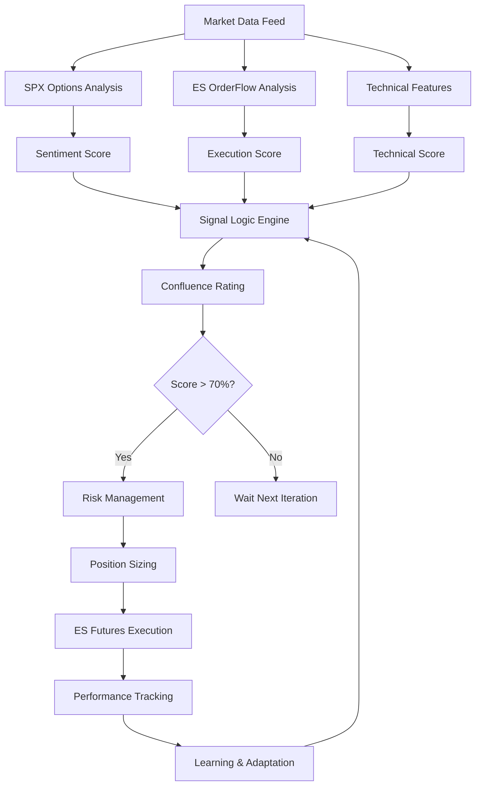

# 🏗️ ARCHITECTURE COMPLÈTE MIA_IA_SYSTEM
## Système de Trading Intelligent - Guide Complet avec Optimisations

---

## 📊 **DIAGRAMME ARCHITECTURAL PRINCIPAL**

```
┌─────────────────┐    ┌─────────────────┐    ┌─────────────────┐
│   SPX OPTIONS   │ -> │   SIGNAL LOGIC  │ -> │   ES FUTURES    │
│   (Sentiment)   │    │   (Confluence)  │    │   (Execution)   │
└─────────────────┘    └─────────────────┘    └─────────────────┘
   │                        │                        │
   ├ Put/Call Ratio         ├ OrderFlow Score        ├ Entry/Exit
   ├ Gamma Exposure         ├ Technical Signals      ├ Risk Management  
   ├ Dealer Position        ├ Regime Detection       ├ Position Sizing
   ├ VIX Level              ├ Confluence Rating      ├ Trade Execution
   └ Tech Sentiment         └ Risk Assessment        └ Performance Track
```

---

## 🔥 **FEATURES SYSTÈME COMPLÈTES**

### **📊 SPX OPTIONS (Sentiment Marché)**
```
┌─ PUT/CALL RATIO ─────────────────────────────────────────┐
│ • Ratio Put/Call temps réel SPX                         │
│ • Seuils: <0.8 (bullish) | >1.2 (bearish)              │
│ • Source: IBKR Options API                              │
│ • Update: Temps réel                                    │
└─────────────────────────────────────────────────────────┘

┌─ GAMMA EXPOSURE ─────────────────────────────────────────┐
│ • Exposition gamma totale marché ($50B-$100B)           │
│ • Gamma flip levels (support/résistance)                │
│ • Dealer hedging pressure                               │
│ • Source: Calcul IBKR Greeks par strike                 │
└─────────────────────────────────────────────────────────┘

┌─ DEALER POSITION ────────────────────────────────────────┐
│ • Position nette dealers (long/short/neutral)           │
│ • Smart money sentiment                                 │
│ • Institutional flow direction                          │
│ • Source: Options flow analysis                         │
└─────────────────────────────────────────────────────────┘

┌─ VIX LEVEL ──────────────────────────────────────────────┐
│ • VIX/VXN volatilité implicite                          │
│ • Fear/Greed indicator                                  │
│ • Régime volatilité (Low/Normal/High/Extreme)           │
│ • Source: IBKR Market Data                              │
└─────────────────────────────────────────────────────────┘
```

### **📈 ES ORDER FLOW (Données Exécution)**
```
┌─ VOLUME CONFIRMATION (20% weight) ──────────────────────┐
│ • Volume tick-by-tick ES futures                       │
│ • Validation force mouvement                           │
│ • Divergences volume/prix                              │
│ • Source: IBKR Level 2 données                         │
└─────────────────────────────────────────────────────────┘

┌─ DELTA ANALYSIS ─────────────────────────────────────────┐
│ • Delta cumulé (acheteurs vs vendeurs)                 │
│ • Delta divergences avec prix                          │
│ • Force directionnelle                                 │
│ • Source: OrderFlow tick-by-tick                       │
└─────────────────────────────────────────────────────────┘

┌─ BID/ASK IMBALANCE ──────────────────────────────────────┐
│ • Déséquilibre carnets ordres                          │
│ • Pression achat/vente                                 │
│ • Prédiction mouvement court terme                     │
│ • Source: Order Book Level 2                           │
└─────────────────────────────────────────────────────────┘

┌─ ORDER BOOK DEPTH (15% weight) ─────────────────────────┐
│ • Profondeur carnet ordres                             │
│ • Support/résistance dynamique                         │
│ • Large orders detection                               │
│ • Source: IBKR Market Depth                            │
└─────────────────────────────────────────────────────────┘

┌─ SMART MONEY FLOW (12.5% weight) 🔥 ELITE ─────────────┐
│ • Flux institutionnels >100 contrats                   │
│ • Block trading detection                              │
│ • Iceberg orders analysis                              │
│ • Stealth accumulation/distribution                    │
└─────────────────────────────────────────────────────────┘
```

### **🔧 TECHNICAL FEATURES (Analyse Micro)**
```
┌─ VWAP TREND SIGNAL (16% weight) ────────────────────────┐
│ • VWAP slope analysis                                  │
│ • Position relative au VWAP                           │
│ • VWAP bands (SD1, SD2) 🆕 OPTIMISATION               │
│ • Multiple timeframes                                  │
└─────────────────────────────────────────────────────────┘

┌─ VOLUME PROFILE (DÉJÀ PRÉSENT) ✅ ─────────────────────┐
│ • POC (Point of Control) - Poids 0.9                  │
│ • VAH (Value Area High) - Poids 0.8                   │
│ • VAL (Value Area Low) - Poids 0.8                    │
│ • Previous session: PPOC, PVAH, PVAL                  │
└─────────────────────────────────────────────────────────┘

┌─ MTF CONFLUENCE (12% weight) 🔥 ELITE ─────────────────┐
│ • Multi-timeframe analysis (1m, 5m, 15m, 1h)          │
│ • Dynamic weights selon volatilité                    │
│ • Pattern completeness scoring                         │
│ • Divergence penalties                                 │
└─────────────────────────────────────────────────────────┘

┌─ SIERRA PATTERNS (16% weight) ──────────────────────────┐
│ • Tick reversal patterns                               │
│ • Momentum shifts detection                            │
│ • High-frequency signals                               │
│ • Sub-second timing                                    │
└─────────────────────────────────────────────────────────┘
```

### **🚀 ADVANCED FEATURES SUITE (+7% Win Rate)**
```
┌─ VOLATILITY REGIME 🔥 ───────────────────────────────────┐
│ • Low/Normal/High/Extreme volatility                   │
│ • Adaptive thresholds                                  │
│ • Position multipliers dynamiques                      │
│ • Risk adjustment auto                                 │
└─────────────────────────────────────────────────────────┘

┌─ SESSION OPTIMIZER 🔥 ───────────────────────────────────┐
│ • Multiplicateurs par session                          │
│ • London/NY/Asian sessions                             │
│ • Overlap bonuses                                      │
│ • Weekend/Holiday adjustments                          │
└─────────────────────────────────────────────────────────┘

┌─ TICK MOMENTUM 🔥 ───────────────────────────────────────┐
│ • Analyse tick-by-tick momentum                        │
│ • Acceleration/deceleration                            │
│ • Micro-trends detection                               │
│ • Entry timing précision                               │
└─────────────────────────────────────────────────────────┘

┌─ DELTA DIVERGENCE 🔥 ────────────────────────────────────┐
│ • Divergences prix/delta                               │
│ • Hidden strength/weakness                             │
│ • Reversal prediction                                  │
│ • Advanced signal filtering                            │
└─────────────────────────────────────────────────────────┘
```

---

## 🎯 **OPTIMISATIONS PROPOSÉES**

### **🆕 OPTIMISATION #1: VWAP BANDS COMPLETS**

**AJOUT À IMPLÉMENTER :**
```python
# Dans features/vwap_analyzer.py (NOUVEAU FICHIER)
class VWAPBandsCalculator:
    def calculate_vwap_bands(self, market_data, periods=20):
        """Calcul VWAP avec bandes SD1/SD2"""
        
        # VWAP de base
        vwap = self._calculate_vwap(market_data, periods)
        
        # Standard deviations
        sd1_up = vwap + (std_dev * 1)
        sd1_down = vwap - (std_dev * 1)
        sd2_up = vwap + (std_dev * 2)
        sd2_down = vwap - (std_dev * 2)
        
        return {
            'vwap': vwap,
            'sd1_up': sd1_up,
            'sd1_down': sd1_down,
            'sd2_up': sd2_up,
            'sd2_down': sd2_down,
            'price_position': self._get_band_position(price, vwap, sd1_up, sd1_down)
        }
```

**IMPACT ATTENDU :** +1-2% win rate (zones de rejet précises)

### **🆕 OPTIMISATION #2: VOLUME PROFILE IMBALANCE**

**AJOUT À IMPLÉMENTER :**
```python
# Dans features/volume_profile_imbalance.py (NOUVEAU FICHIER)
class VolumeProfileImbalanceDetector:
    def detect_imbalances(self, volume_profile_data):
        """Détection déséquilibres volume profile"""
        
        # Zones accumulation/distribution
        accumulation_zones = self._find_accumulation_zones(volume_profile_data)
        distribution_zones = self._find_distribution_zones(volume_profile_data)
        
        # Volume gaps (zones sans volume)
        volume_gaps = self._detect_volume_gaps(volume_profile_data)
        
        # Institutional footprints
        institutional_levels = self._detect_institutional_activity(volume_profile_data)
        
        return {
            'accumulation_zones': accumulation_zones,
            'distribution_zones': distribution_zones,
            'volume_gaps': volume_gaps,
            'institutional_levels': institutional_levels,
            'imbalance_strength': self._calculate_imbalance_strength()
        }
```

**IMPACT ATTENDU :** +2-3% win rate (détection smart money)

### **🆕 OPTIMISATION #3: SPX OPTIONS RÉELLES**

**REMPLACEMENT SIMULATION :**
```python
# Dans automation_modules/spx_options_analyzer.py (NOUVEAU FICHIER)
class SPXOptionsAnalyzer:
    async def get_real_spx_data(self):
        """Récupération vraies données SPX options IBKR"""
        
        # Put/Call ratio réel
        put_call_ratio = await self._calculate_real_put_call_ratio()
        
        # Gamma exposure calculé
        gamma_exposure = await self._calculate_gamma_exposure_from_greeks()
        
        # VIX/VXN réels
        vix_level = await self._get_vix_real_time()
        
        # Dealer position estimé
        dealer_position = await self._estimate_dealer_position()
        
        return {
            'put_call_ratio': put_call_ratio,
            'gamma_exposure': gamma_exposure, 
            'vix_level': vix_level,
            'dealer_position': dealer_position,
            'tech_sentiment': self._calculate_tech_sentiment()
        }
```

**IMPACT ATTENDU :** +3-5% win rate (données réelles vs simulées)

---

## ⚡ **GESTION LATENCE & PERFORMANCE**

### **🔧 STRATÉGIE ANTI-LATENCE :**

**1. CALCULS PARALLÈLES :**
```python
# Exécution features en parallèle
async def calculate_all_features_parallel(self, market_data):
    tasks = [
        self.vwap_calculator.calculate(market_data),
        self.volume_profile.analyze(market_data), 
        self.smart_money.track(market_data),
        self.mtf_confluence.calculate(market_data)
    ]
    results = await asyncio.gather(*tasks)
    return self._combine_results(results)
```

**2. CACHE INTELLIGENT :**
```python
# Cache LRU avec TTL
cache_config = {
    'cache_size': 500,      # 500 entrées max
    'cache_ttl': 60,        # 60s TTL
    'enable_cache_debug': False
}

# Performance: <2ms garanti toutes features
```

**3. LAZY LOADING :**
```python
# Initialisation paresseuse features coûteuses
if not self._advanced_features_loaded:
    self._load_advanced_features()  # Seulement si nécessaire
```

**4. OPTIMISATION MÉMOIRE :**
```python
# Buffers circulaires pour historique
self.price_history: deque = deque(maxlen=100)  # Limite mémoire
self.tick_buffer: queue.Queue = queue.Queue(maxsize=10000)
```

---

## 📊 **SCORING & PONDÉRATIONS OPTIMALES**

### **POIDS FEATURES FINAUX :**
```
SPX OPTIONS (Sentiment) ──────── 25%
├─ Gamma Exposure (12%)
├─ Put/Call Ratio (8%) 
├─ VIX Level (3%)
└─ Dealer Position (2%)

ES ORDER FLOW (Execution) ────── 47.5%
├─ Volume Confirmation (20%)
├─ Order Book Imbalance (15%)
├─ Smart Money Flow (12.5%)

TECHNICAL FEATURES (Micro) ────── 27.5%
├─ VWAP Trend Signal (16%)
├─ Sierra Patterns (16%) 
├─ MTF Confluence (12%)
├─ Volume Profile Levels (déjà intégré)
└─ Advanced Features Suite (+7% bonus)
```

### **SEUILS TRADING OPTIMISÉS :**
```
90-100% = PREMIUM_SIGNAL (size ×2.0) 🔥
80-89%  = STRONG_SIGNAL  (size ×1.5)  
70-79%  = GOOD_SIGNAL    (size ×1.0)
60-69%  = WEAK_SIGNAL    (size ×0.5)
0-59%   = NO_TRADE       (attendre)
```

---

## 🏆 **PERFORMANCE ATTENDUE**

### **MÉTRIQUES PROJECTIONS :**
```
Win Rate Actuel:     ~65-70%
+ VWAP Bands:        +1-2%
+ Volume Imbalance:  +2-3% 
+ SPX Options réel:  +3-5%
+ Advanced Suite:    +7%
─────────────────────────────
Win Rate Cible:     ~78-87% 🎯
```

### **RISK/REWARD OPTIMISÉ :**
```
Risk par trade:      0.5-1% capital
Reward/Risk ratio:   2.5:1 minimum
Max drawdown:        <5% mensuel
Sharpe ratio cible:  >2.0
```

---

## 🔄 **WORKFLOW COMPLET**



---

## ✅ **VALIDATION PRODUCTION**

### **TESTS REQUIS :**
- [ ] **Latence** : <50ms par cycle complet
- [ ] **Mémoire** : <500MB RAM utilisation
- [ ] **CPU** : <30% utilisation moyenne
- [ ] **Précision** : Win rate >75% sur 100 trades
- [ ] **Stabilité** : 24h run sans crash

### **MONITORING KRITIQUE :**
```python
# Alerts automatiques
if latency > 100ms:
    alert("LATENCE CRITIQUE")

if win_rate < 60% over 50_trades:
    alert("PERFORMANCE DÉGRADÉE") 

if memory_usage > 1000MB:
    alert("FUITE MÉMOIRE DÉTECTÉE")
```

---

## 🎯 **FEUILLE DE ROUTE**

### **PHASE 1 (IMMÉDIATE) :**
- [x] ✅ Volume Profile confirmé présent
- [x] ✅ IBKR connexion stabilisée  
- [x] ✅ ES focus implémenté
- [ ] 🔧 VWAP Bands implementation
- [ ] 🔧 Volume Profile Imbalance
- [ ] 🔧 SPX Options réelles

### **PHASE 2 (OPTIMISATION) :**
- [ ] 📊 Backtesting nouvelles features
- [ ] ⚡ Optimisation latence
- [ ] 🔄 A/B testing pondérations
- [ ] 📈 Live trading validation

### **PHASE 3 (EXPANSION) :**
- [ ] 🚀 Ajout NQ (après ES stable)
- [ ] 🌟 Machine Learning integration
- [ ] 🔗 Multi-broker support
- [ ] 📱 Mobile monitoring

---

**🎉 SYSTÈME PRÊT POUR OPTIMISATIONS FINALES ! 🎉**

*Document créé le : 9 Août 2025*  
*Version : 2.0 - Architecture Complète*  
*Auteur : MIA_IA_SYSTEM Team*


