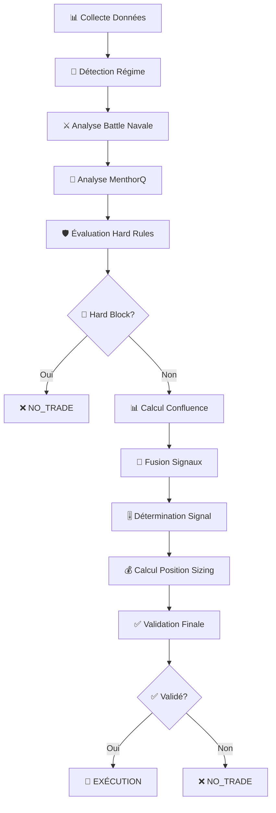

# 🤖 **MÉTHODE DE TRADING BOT MIA_IA_SYSTEM**
## **Document Technique Complet - Version Production Ready v3.4.0**

---

## 📋 **TABLE DES MATIÈRES**

1. [🎯 Vue d'Ensemble du Système](#vue-densemble)
2. [🧠 Architecture de Décision](#architecture-decision)
3. [📊 Features et Confluence](#features-confluence)
4. [⚡ Méthodes de Trading](#methodes-trading)
5. [🎚️ Seuils et Paramètres](#seuils-parametres)
6. [🛡️ Gestion des Risques](#gestion-risques)
7. [🔄 Processus d'Exécution](#processus-execution)
8. [📈 OrderFlow et Smart Money](#orderflow-smart-money)
9. [🎪 Patterns et Signaux](#patterns-signaux)
10. [⚙️ Configuration Implémentée](#configuration-implémentée)

---

## 🎯 **VUE D'ENSEMBLE DU SYSTÈME** {#vue-densemble}

### **🏗️ Architecture Principale**

Le bot MIA_IA_SYSTEM utilise une **architecture multi-couches** avec orchestration intelligente :

```
┌─────────────────────────────────────────────────────────────┐
│                    🎪 ORCHESTRATEUR PRINCIPAL                │
│                 (StrategySelector + MenthorQ Integration)    │
└─────────────────────┬───────────────────────────────────────┘
                      │
┌─────────────────────┴───────────────────────────────────────┐
│  🧠 DÉTECTION RÉGIME MARCHÉ + FUSION SIGNAUX               │
│  • Battle Navale (60%) + MenthorQ (40%)                    │
│  • Smart Money Tracker (12.5% weight)                      │
│  • OrderFlow Analysis                                       │
└─────────────────────┬───────────────────────────────────────┘
                      │
┌─────────────────────┴───────────────────────────────────────┐
│  📊 CALCULATEUR CONFLUENCE (11 Features)                   │
│  • Gamma Levels (20.2%) • Volume Confirmation (14.4%)      │
│  • VWAP Trend (11.6%) • Sierra Patterns (11.6%)            │
│  • Order Book Imbalance (10.8%) • Options Flow (9.4%)      │
└─────────────────────┬───────────────────────────────────────┘
                      │
┌─────────────────────┴───────────────────────────────────────┐
│  🛡️ GESTION RISQUES + EXÉCUTION                           │
│  • Hard Rules (MenthorQ) • Position Sizing • Stop Loss     │
│  • Daily Limits • VIX Caps • Cooldown Management           │
└─────────────────────────────────────────────────────────────┘
```

### **🎯 Objectifs de Performance**

- **Win Rate Cible** : 75-80%
- **Fréquence Signaux** : +150% (PRIORITÉ #2)
- **Amélioration Attendue** : +2-3% win rate avec Smart Money
- **Réduction Faux Signaux** : 25%

---

## 🧠 **ARCHITECTURE DE DÉCISION** {#architecture-decision}

### **🔄 Processus de Décision en 10 Étapes**

```python
def processus_decision_trading():
    """
    Processus complet de décision de trading
    """
    
    # 1. COLLECTE DONNÉES
    market_data = collect_market_data()  # OHLC, Volume, OrderFlow
    menthorq_levels = get_menthorq_levels()  # Gamma, Blind Spots, Swing
    vix_data = get_vix_level()  # Régime volatilité
    dealers_bias = calculate_dealers_bias()  # Biais institutionnels
    
    # 2. DÉTECTION RÉGIME MARCHÉ
    market_regime = detect_market_regime(market_data)
    # Régimes: TRENDING, RANGING, VOLATILE, LOW_VOLATILITY
    
    # 3. ANALYSE BATTLE NAVALE
    bn_result = analyze_battle_navale(market_data, orderflow_data)
    # Patterns: Long Down Up Bar, Color Down Setting, etc.
    
    # 4. ANALYSE MENTHORQ
    mq_result = analyze_menthorq_signal(current_price, menthorq_levels)
    # Niveaux: Gamma Walls, Blind Spots, Swing Levels
    
    # 5. ÉVALUATION HARD RULES
    execution_rules = evaluate_execution_rules(
        current_price, menthorq_levels, vix_regime, dealers_bias
    )
    if execution_rules.hard_block:
        return Decision("NO_TRADE", reasons=execution_rules.reasons)
    
    # 6. CALCUL CONFLUENCE
    confluence_score = calculate_confluence_score(market_data)
    # 11 features pondérées (100% total)
    
    # 7. FUSION SIGNAUX
    final_score = fuse_signals(bn_result, mq_result, dealers_bias)
    # Battle Navale (60%) + MenthorQ (40%)
    
    # 8. DÉTERMINATION SIGNAL
    signal_name = determine_signal_name(final_score)
    # LONG, SHORT, NO_TRADE
    
    # 9. CALCUL POSITION SIZING
    position_size = calculate_position_sizing(
        base_size, vix_regime, execution_rules, confluence_score
    )
    
    # 10. VALIDATION FINALE
    if validate_final_decision(signal_name, position_size, risk_limits):
        return execute_trade(signal_name, position_size)
    else:
        return Decision("NO_TRADE", reason="Validation échouée")
```

### **🎪 Orchestrateur Principal**

**Fichier** : `strategies/strategy_selector.py`

```python
class StrategySelector:
    """
    CHEF D'ORCHESTRE DU SYSTÈME TRADING
    
    Responsabilités :
    1. Orchestration complète : Regime → Strategy → Features → Signal
    2. Validation finale avec tous critères qualité
    3. Gestion transitions régimes intelligente
    4. Performance tracking système global
    5. Adaptation paramètres selon régime
    """
    
    def __init__(self):
        # Composants principaux
        self.regime_detector = create_market_regime_detector()
        self.feature_calculator = create_feature_calculator()
        self.trend_strategy = create_trend_strategy()
        self.range_strategy = create_range_strategy()
        
        # Seuils validation finale
        self.min_confluence_for_execution = 0.70
        self.min_regime_confidence = 0.60
```

---

## 📊 **FEATURES ET CONFLUENCE** {#features-confluence}

### **🎯 Modèle 11 Dimensions (Production)**

**Fichier** : `config_files/feature_config.json`

```python
INTEGRATED_CONFLUENCE_WEIGHTS = {
    # Features principales (optimisées)
    'gamma_levels_proximity': 0.202,    # 20.2% - Gamma SpotGamma style
    'volume_confirmation': 0.144,       # 14.4% - Volume OrderFlow
    'vwap_trend_signal': 0.116,         # 11.6% - VWAP direction
    'sierra_pattern_strength': 0.116,   # 11.6% - Patterns Sierra
    'order_book_imbalance': 0.108,      # 10.8% - Depth 5 imbalance
    'options_flow_bias': 0.094,         # 9.4% - Options sentiment
    'smart_money_strength': 0.090,      # 9.0% - Smart Money (100/500)
    'level_proximity': 0.051,           # 5.1% - Market Profile
    'es_nq_correlation': 0.051,         # 5.1% - ES/NQ alignment
    'session_context': 0.018,           # 1.8% - Session performance
    'pullback_quality': 0.011,          # 1.1% - Anti-FOMO patience
}
# TOTAL = 100.0% ✅
```

### **🔍 Détail des Features Principales**

#### **1. Gamma Levels Proximity (20.2%)**
```python
gamma_levels_proximity = {
    "description": "Proximité aux niveaux gamma options",
    "calculation": {
        "method": "distance_to_gamma_levels_enhanced",
        "max_distance_points": 8,
        "level_strength_weighting": true,
        "proximity_strictness": "enhanced"
    },
    "gamma_types": {
        "call_wall": {
            "resistance_strength": 1.0,
            "proximity_boost": 1.3,
            "max_distance_ticks": 8
        },
        "put_wall": {
            "support_strength": 1.0,
            "proximity_boost": 1.3,
            "max_distance_ticks": 8
        },
        "gamma_flip": {
            "transition_signal": 1.5,
            "volatility_impact": true
        }
    }
}
```

#### **2. Volume Confirmation (14.4%)**
```python
volume_confirmation = {
    "description": "Confirmation volume et order flow",
    "calculation": {
        "method": "enhanced_volume_analysis",
        "volume_ratio_threshold": 1.8,
        "aggressive_trades_sensitivity": 8.0,
        "volume_price_correlation": true
    },
    "components": {
        "volume_analysis": 0.45,
        "order_flow_confirmation": 0.35,
        "volume_trend_consistency": 0.20
    }
}
```

#### **3. Smart Money Strength (9.0%) - NOUVEAU**
```python
smart_money_strength = {
    "description": "🆕 TECHNIQUE #2 ELITE - Force des flux institutionnels",
    "calculation": {
        "method": "institutional_flow_analysis",
        "large_trade_threshold": 100,
        "block_trade_threshold": 500,
        "volume_surge_multiplier": 2.0,
        "behavioral_pattern_detection": true
    },
    "behavioral_patterns": {
        "iceberg_detection": {
            "enabled": true,
            "size_fragmentation_threshold": 0.3,
            "time_distribution_analysis": true
        },
        "sweep_detection": {
            "enabled": true,
            "aggressive_level_clearing": true,
            "momentum_confirmation": true
        },
        "block_cross_detection": {
            "enabled": true,
            "institutional_timing": true,
            "dark_pool_indicators": true
        }
    }
}
```

---

## ⚡ **MÉTHODES DE TRADING** {#methodes-trading}

### **🎯 Seuils de Trading Optimisés**

**Fichier** : `docs/CONFIGURATION_FINALE_PRODUCTION.md`

```python
OPTIMIZED_TRADING_THRESHOLDS = {
    'PREMIUM_SIGNAL': 0.38,    # 38%+ = Premium trade (size ×2.0)
    'STRONG_SIGNAL': 0.32,     # 32%+ = Strong trade (size ×1.5)
    'GOOD_SIGNAL': 0.28,       # 28%+ = Good trade (size ×1.0)
    'WEAK_SIGNAL': 0.18,       # 18%+ = Weak trade (size ×0.5)
    'NO_TRADE': 0.00,          # <18% = No trade (wait)
}
```

### **🔢 Qualité des Signaux**

```python
class OptimizedSignalQuality(Enum):
    PREMIUM = "premium"     # 38-100% - Position ×2.0
    STRONG = "strong"       # 32-37%  - Position ×1.5
    GOOD = "good"          # 28-31%  - Position ×1.0
    WEAK = "weak"          # 18-27%  - Position ×0.5
    NO_TRADE = "no_trade"  # 0-17%   - Pas de trade
```

### **🎪 Battle Navale - Méthode Principale**

**Fichier** : `core/battle_navale.py`

```python
class BattleNavaleAnalyzer:
    """
    Analyseur Battle Navale - Méthode de trading principale
    """
    
    def analyze_battle_navale(self, market_data, order_flow=None):
        """
        Analyse complète Battle Navale
        
        Returns:
            BattleNavaleResult avec score, patterns, confidence
        """
        
        # 1. Détection patterns Sierra Chart
        sierra_patterns = self._detect_all_sierra_patterns()
        
        # 2. Analyse Vikings vs Defenders
        battle_analysis = self._analyze_vikings_vs_defenders(market_data, order_flow)
        
        # 3. Calcul signal composite
        signal = self._calculate_composite_signal(
            sierra_patterns, battle_analysis, market_data
        )
        
        return BattleNavaleResult(
            score=signal,
            patterns=sierra_patterns,
            battle_outcome=battle_analysis,
            confidence=self._calculate_confidence(signal)
        )
```

### **🎯 MenthorQ Integration**

**Fichier** : `core/menthorq_integration.py`

```python
def analyze_menthorq_integration(
    symbol: str,
    current_price: float,
    vix_level: Optional[float] = None,
    levels: Optional[Dict[str, Any]] = None,
    dealers_bias: float = 0.0,
    bn_result: Optional[Any] = None,
    runtime: Optional[Any] = None
) -> Decision:
    """
    Analyse complète MenthorQ + Battle Navale + Dealers Bias + VIX
    
    Processus :
    1. Évaluation hard rules (bloquantes)
    2. Analyse Battle Navale (60%)
    3. Analyse MenthorQ (40%)
    4. Fusion des signaux
    5. Calcul position sizing
    6. Validation finale
    """
    
    # Hard rules en premier
    execution_result = evaluate_execution_rules(
        current_price, levels, vix_regime, dealers_bias, runtime
    )
    
    if execution_result.hard_block:
        return Decision("NO_TRADE", reasons=execution_result.reasons)
    
    # Fusion signaux
    final_score = _fuse_signals(bn_score, mq_score, dealers_bias, runtime)
    
    # Position sizing
    position_sizing = _calculate_position_sizing(
        base_size, vix_regime, execution_result, levels, current_price
    )
    
    return Decision(
        name=signal_name,
        score=final_score,
        position_sizing=position_sizing,
        rationale=rationale
    )
```

---

## 🎚️ **SEUILS ET PARAMÈTRES** {#seuils-parametres}

### **🎯 Seuils Battle Navale (PRIORITÉ #2)**

**Fichier** : `config/constants.py`

```python
BATTLE_NAVALE_THRESHOLDS = {
    'priority_2_new': {
        'long_threshold': 0.25,     # NOUVEAU: Abaissé de 0.35
        'short_threshold': -0.25,   # NOUVEAU: Abaissé de -0.35
        'version': '2.1.0',
        'description': 'Seuils calibrés PRIORITÉ #2 pour +150% fréquence'
    }
}

BATTLE_NAVALE_QUALITY_THRESHOLDS = {
    'premium': 0.75,      # Signaux premium (>75%)
    'strong': 0.60,       # Signaux strong (60-75%)
    'moderate': 0.45,     # Signaux modérés (45-60%)
    'weak': 0.30,         # Signaux faibles (30-45%)
    'rejected': 0.15      # Seuil rejet (< 15%)
}
```

### **🛡️ Seuils de Confiance**

```python
CONFIDENCE_THRESHOLDS = {
    "signal_generation": {
        "minimum_confidence": 0.60,
        "high_confidence": 0.75,
        "premium_confidence": 0.85
    },
    "pattern_specific": {
        "battle_navale": {
            "minimum": 0.65,
            "preferred": 0.75,
            "base_quality_min": 0.60,
            "rouge_sous_verte_required": true
        },
        "gamma_pin": {
            "minimum": 0.70,
            "preferred": 0.80,
            "proximity_max_ticks": 3
        },
        "confluence_trade": {
            "minimum": 0.75,
            "preferred": 0.85,
            "min_confluence_sources": 3
        },
        "smart_money_signal": {
            "minimum": 0.60,
            "preferred": 0.75,
            "premium": 0.85,
            "institutional_threshold": 100,
            "alignment_boost_required": true
        }
    }
}
```

### **📊 Seuils Dynamiques**

```python
DYNAMIC_THRESHOLDS = {
    "base_threshold": 0.25,        # Seuil de base
    "low_volatility": 0.20,        # Plus agressif en basse vol
    "high_volatility": 0.35,       # Plus conservateur en haute vol
    "session_adjustments": {
        "opening_hour": 1.2,       # +20% pendant ouverture
        "power_hour": 1.2,         # +20% pendant power hour
        "overnight": 0.5           # -50% pendant nuit
    }
}
```

---

## 🛡️ **GESTION DES RISQUES** {#gestion-risques}

### **🎯 Limites Quotidiennes**

**Fichier** : `config_files/risk_params.json`

```python
DAILY_LIMITS = {
    "max_daily_loss": 500.0,           # 500$ max/jour
    "max_daily_trades": 25,            # 25 trades max/jour
    "max_consecutive_losses": 4,       # 4 pertes consécutives max
    "daily_profit_target": 300.0,      # Target 300$/jour
    "stop_trading_on_target": false,   # Continue après target
    "cool_down_periods": {
        "after_max_loss": 24,          # 24h cooldown après max loss
        "after_consecutive_losses": 2, # 2h cooldown après 4 pertes
        "after_daily_target": 0        # Pas de cooldown après target
    }
}
```

### **💰 Position Sizing**

```python
POSITION_SIZING = {
    "base_position_size": 1,           # Taille de base
    "max_position_size": 2,            # Taille max
    "max_positions_concurrent": 2,     # 2 positions max simultanées
    "position_sizing_method": "fixed", # Méthode fixe
    "dynamic_sizing": {
        "enabled": false,              # Désactivé pour sécurité
        "confidence_based": {
            "high_confidence_multiplier": 1.5,
            "low_confidence_multiplier": 0.5,
            "confidence_threshold": 0.75
        }
    }
}
```

### **🛑 Stop Loss et Take Profit**

```python
STOP_LOSS_CONFIG = {
    "default_stop_ticks": 10,          # Stop par défaut 10 ticks
    "stop_strategies": {
        "fixed": {
            "enabled": true,
            "stop_distance_ticks": 10,
            "description": "Stop fixe à 10 ticks (40$ pour ES)"
        },
        "pattern_based": {
            "enabled": true,
            "battle_navale_stop": 8,   # Stop plus serré pour BN
            "gamma_pin_stop": 6,       # Stop très serré pour gamma pin
            "confluence_stop": 12      # Stop plus large pour confluence
        }
    },
    "trailing_stop": {
        "enabled": false,              # Désactivé pour sécurité
        "initial_distance_ticks": 15,
        "trail_amount_ticks": 2,
        "min_profit_before_trail": 8
    }
}
```

### **🎪 Hard Rules MenthorQ**

**Fichier** : `core/menthorq_execution_rules.py`

```python
def evaluate_execution_rules(
    current_price: float,
    levels: Dict[str, Any],
    vix_regime: VIXRegime,
    dealers_bias: float,
    runtime: Optional[Any] = None
) -> ExecutionRulesResult:
    """
    Évalue les règles d'exécution MenthorQ
    
    HARD RULES (bloquantes) :
    1. Blind Spot proche (≤5 ticks)
    2. VIX HIGH + BL proche (≤7.5 ticks)
    3. Niveaux MenthorQ stales
    4. Cooldown après stop-out (15min)
    
    SOFT ADJUSTMENTS (non bloquants) :
    1. Gamma Wall proche → sizing ×0.5
    2. Swing adverse → sizing ×0.7
    3. Dealers Bias négatif → sizing ×0.8
    4. VIX cap (LOW:1.0, MID:0.6, HIGH:0.4)
    5. Spread large → sizing ×0.8
    """
```

---

## 🔄 **PROCESSUS D'EXÉCUTION** {#processus-execution}

### **🎯 Workflow Complet**



### **⚡ Temps de Réaction**

```python
REAL_TIME_CALCULATION = {
    "update_frequency_ms": 100,        # Mise à jour toutes les 100ms
    "calculation_timeout_ms": 5,       # Timeout calcul 5ms
    "parallel_processing": true,       # Traitement parallèle
    "cache_intermediate_results": true, # Cache résultats intermédiaires
    "feature_staleness_threshold_ms": 500, # Données périmées après 500ms
    "performance_optimization": {
        "expected_speedup": "5%",
        "expected_win_rate_boost": "2-3%"
    }
}
```

### **🎪 Orchestration des Composants**

```python
class TradingOrchestrator:
    """
    Orchestrateur principal du système de trading
    """
    
    async def process_trading_cycle(self, market_data):
        """
        Cycle complet de trading
        """
        
        # 1. Collecte données (parallèle)
        tasks = [
            self.collect_market_data(),
            self.get_menthorq_levels(),
            self.get_vix_data(),
            self.calculate_dealers_bias()
        ]
        results = await asyncio.gather(*tasks)
        
        # 2. Analyse (séquentielle)
        regime = self.detect_market_regime(results[0])
        bn_result = self.analyze_battle_navale(results[0])
        mq_result = self.analyze_menthorq(results[1])
        
        # 3. Décision
        decision = self.make_trading_decision(
            regime, bn_result, mq_result, results[2], results[3]
        )
        
        # 4. Exécution
        if decision.should_trade:
            await self.execute_trade(decision)
        
        return decision
```

---

## 📈 **ORDERFLOW ET SMART MONEY** {#orderflow-smart-money}

### **🔍 OrderFlow Analyzer**

**Fichier** : `automation_modules/orderflow_analyzer.py`

```python
class OrderFlowAnalyzer:
    """
    Analyseur OrderFlow avancé
    """
    
    async def analyze_orderflow_data(self, market_data):
        """
        Analyse les données OrderFlow et génère des signaux
        
        Analyses spécialisées :
        1. Volume Profile Analysis
        2. Delta Imbalance Analysis  
        3. Footprint Analysis
        4. Level2 Data Analysis
        """
        
        # Extraire données OrderFlow
        orderflow_data = self._extract_orderflow_data(market_data)
        
        # Analyses spécialisées
        volume_analysis = await self._analyze_volume_profile(orderflow_data)
        delta_analysis = await self._analyze_delta_imbalance(orderflow_data)
        footprint_analysis = await self._analyze_footprint(orderflow_data)
        level2_analysis = await self._analyze_level2_data(orderflow_data)
        
        # Génération signal
        signal = await self._generate_orderflow_signal(
            orderflow_data, volume_analysis, delta_analysis, 
            footprint_analysis, level2_analysis
        )
        
        return signal
```

### **🧠 Smart Money Tracker**

**Fichier** : `features/smart_money_tracker.py`

```python
class SmartMoneyTracker:
    """
    🆕 TECHNIQUE #2 ELITE - Détection flux institutionnels
    """
    
    def analyze_institutional_flow(self, market_data):
        """
        Analyse les flux institutionnels
        
        Détection patterns :
        1. Iceberg Detection (fragmentation)
        2. Sweep Detection (nettoyage agressif)
        3. Block Cross Detection (timing institutionnel)
        4. Stealth Mode Detection (accumulation graduelle)
        """
        
        # Détection large trades
        large_trades = self._detect_large_trades(market_data)
        
        # Analyse patterns comportementaux
        behavioral_patterns = self._analyze_behavioral_patterns(large_trades)
        
        # Analyse alignement structure
        structure_alignment = self._analyze_structure_alignment(
            behavioral_patterns, market_data
        )
        
        # Calcul force Smart Money
        smart_money_strength = self._calculate_smart_money_strength(
            large_trades, behavioral_patterns, structure_alignment
        )
        
        return SmartMoneyAnalysis(
            strength=smart_money_strength,
            patterns=behavioral_patterns,
            alignment=structure_alignment
        )
```

### **📊 Paramètres Smart Money**

```python
SMART_MONEY_PARAMETERS = {
    "detection_parameters": {
        "large_trade_threshold": 100,      # Trades >100 contrats
        "block_trade_threshold": 500,      # Block trades >500 contrats
        "volume_surge_multiplier": 2.0,    # Surge volume 2x
        "lookback_minutes": 60,            # Fenêtre analyse 60min
        "flow_analysis_window": 15,        # Fenêtre flow 15min
        "persistence_periods": 5,          # Périodes persistance
        "min_trades_for_signal": 3,        # Min 3 trades pour signal
        "min_volume_for_analysis": 1000,   # Min volume analyse
        "confidence_threshold": 0.6        # Seuil confiance
    },
    "behavioral_patterns": {
        "iceberg_detection": {
            "enabled": true,
            "size_fragmentation_threshold": 0.3,
            "time_distribution_analysis": true
        },
        "sweep_detection": {
            "enabled": true,
            "aggressive_level_clearing": true,
            "momentum_confirmation": true
        }
    }
}
```

---

## 🎪 **PATTERNS ET SIGNAUX** {#patterns-signaux}

### **⚔️ Battle Navale Patterns**

```python
SIERRA_PATTERNS = {
    "long_down_up_bar": {
        "description": "Barre longue vers le bas puis remontée",
        "signal_strength": 0.8,
        "confidence_boost": 0.1
    },
    "long_up_down_bar": {
        "description": "Barre longue vers le haut puis descente",
        "signal_strength": -0.8,
        "confidence_boost": 0.1
    },
    "color_down_setting": {
        "description": "Changement couleur vers le bas",
        "signal_strength": -0.6,
        "confidence_boost": 0.05
    },
    "rouge_sous_verte": {
        "description": "Rouge sous verte (signal fort)",
        "signal_strength": 1.0,
        "confidence_boost": 0.2,
        "required_for_premium": true
    }
}
```

### **🎯 MenthorQ Levels**

```python
MENTHORQ_LEVELS = {
    "gamma": {
        "call_wall": "Résistance gamma calls",
        "put_wall": "Support gamma puts",
        "gamma_flip": "Transition gamma",
        "max_distance_ticks": 8
    },
    "blind_spots": {
        "description": "Zones de faible liquidité",
        "hard_block_distance": 5,  # Hard block si ≤5 ticks
        "soft_adjustment_distance": 10
    },
    "swing": {
        "description": "Niveaux de swing",
        "adverse_check": true,
        "min_stop_ticks": 8
    }
}
```

### **🔄 Pattern Strategies Registry**

```python
PATTERN_STRATEGIES = [
    GammaPinReversion(),              # Reversion gamma pin
    DealerFlipBreakout(),            # Breakout dealer flip
    LiquiditySweepReversal(),        # Reversal après sweep
    StackedImbalanceContinuation(),  # Continuation imbalance
    IcebergTrackerFollow(),          # Suivi iceberg
    CvdDivergenceTrap(),             # Piège divergence CVD
    OpeningDriveFail(),              # Échec ouverture
    EsNqLeadLagMirror(),             # Mirror ES/NQ
    VwapBandSqueezeBreak(),          # Break VWAP squeeze
    ProfileGapFill(),                # Remplissage gap profile
]
```

---

## ⚙️ **CONFIGURATION IMPLÉMENTÉE** {#configuration-implémentée}

### **🎯 Fichiers de Configuration Principaux**

1. **`config_files/feature_config.json`** - Configuration features (11 dimensions)
2. **`config_files/risk_params.json`** - Paramètres gestion risques
3. **`config/constants.py`** - Constantes centralisées
4. **`core/menthorq_execution_rules.py`** - Règles d'exécution MenthorQ
5. **`docs/CONFIGURATION_FINALE_PRODUCTION.md`** - Configuration production

### **🔄 Modes de Fonctionnement**

```python
TRADING_MODES = {
    "data_collection": {
        "enabled": true,
        "max_position_size": 3,
        "risk_per_trade": 0.02
    },
    "paper_trading": {
        "enabled": true,
        "max_position_size": 2,
        "risk_per_trade": 0.015
    },
    "live_trading": {
        "enabled": false,  # À activer manuellement
        "max_position_size": 1,
        "risk_per_trade": 0.01
    },
    "conservative": {
        "enabled": true,
        "max_position_size": 1,
        "risk_per_trade": 0.005
    }
}
```

### **📊 Monitoring et Alerts**

```python
MONITORING_CONFIG = {
    "feature_quality_monitoring": {
        "enabled": true,
        "quality_threshold": 0.8,
        "alert_on_degradation": true
    },
    "calculation_performance": {
        "monitor_timing": true,
        "alert_on_slow_calculation": true,
        "max_calculation_time_ms": 5
    },
    "smart_money_monitoring": {
        "track_detection_rate": true,
        "track_signal_accuracy": true,
        "track_institutional_flow": true,
        "alert_on_unusual_activity": true
    }
}
```

---

## 🎯 **RÉSUMÉ EXÉCUTIF**

### **✅ Ce qui est Implémenté**

1. **🧠 Architecture Complète** : Orchestrateur multi-couches avec 11 features
2. **⚔️ Battle Navale** : Méthode principale avec patterns Sierra Chart
3. **🎯 MenthorQ Integration** : Niveaux gamma, blind spots, swing
4. **🧠 Smart Money Tracker** : Détection flux institutionnels (NOUVEAU)
5. **🛡️ Gestion Risques** : Hard rules, position sizing, stop loss
6. **📊 OrderFlow Analysis** : Volume profile, delta imbalance, footprint
7. **🎚️ Seuils Optimisés** : PRIORITÉ #2 pour +150% fréquence signaux
8. **⚡ Temps Réel** : Calcul <5ms, mise à jour 100ms

### **🎯 Performance Attendue**

- **Win Rate** : 75-80%
- **Fréquence Signaux** : +150% (PRIORITÉ #2)
- **Amélioration** : +2-3% win rate avec Smart Money
- **Réduction Faux Signaux** : 25%

### **🔄 Processus de Trading**

1. **Collecte** → Données marché, MenthorQ, VIX, Dealers Bias
2. **Analyse** → Battle Navale (60%) + MenthorQ (40%)
3. **Validation** → Hard rules, confluence, confidence
4. **Décision** → Signal final avec position sizing
5. **Exécution** → Trade avec stop loss et take profit

### **🛡️ Sécurité**

- **Limites Quotidiennes** : 500$ max loss, 25 trades max
- **Hard Rules** : Blind spots, VIX HIGH, niveaux stales
- **Position Sizing** : Adaptatif selon VIX et confluence
- **Stop Loss** : Fixe 10 ticks ou adaptatif selon pattern

---

**📅 Dernière Mise à Jour** : 12 Janvier 2025  
**🔖 Version** : Production Ready v3.4.0  
**👨‍💻 Statut** : ✅ **PRÊT TRADING LIVE**


