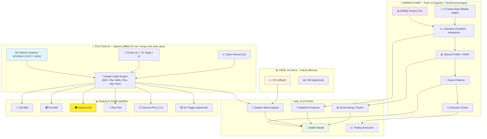

# 🏗️ SCHÉMA VISUEL - ARCHITECTURE FOURNISSEURS DE DONNÉES MIA_IA_SYSTEM

## 📊 Vue d'ensemble de l'architecture

Ce schéma présente la répartition optimisée des fournisseurs de données pour le système MIA_IA, avec une séparation claire des rôles pour éviter doublons et instabilités.

---

## 🎯 SCHÉMA PRINCIPAL (CORRIGÉ AVEC VRAIS COÛTS)



---

## 🔄 FLUX DE DONNÉES DÉTAILLÉ

### 1. **POLYGON.IO → DEALER'S BIAS**
```
Options SPX/NDX → Greeks Calculation → GEX Analysis → Dealer's Bias Score
                ↓
Put/Call Ratios → IV Skew → Gamma Levels → Niveaux Sierra Chart
```

### 2. **SIERRA CHART → ORDERFLOW**
```
ES/NQ Tick Data → Level 2 Analysis → Orderflow Features → Battle Navale
                ↓
Volume Profile → Smart Money → Pattern Recognition → Trading Signals
```

### 3. **CBOE → VIX COMPONENT**
```
VIX Real-time → Volatility Regime → Dealer's Bias Component (25%)
```

---

## 📋 MATRICE DES RESPONSABILITÉS (ACTUALISÉE)

| Type de données | 🚀 Polygon.io | ⚡ Sierra Chart | 📊 CBOE | Endpoint/Source | Utilisation MIA |
|------------------|---------------|----------------|---------|-----------------|-----------------|
| **Options SPX/NDX** | ✅ Principal | ❌ | ❌ | Options Chain Snapshot | Dealer's Bias (75%) |
| **Greeks (Δ,Γ,Θ,V)** | ✅ Principal | ❌ | ❌ | API Response + Calculs | Gamma Analysis |
| **Open Interest** | ✅ Principal | ❌ | ❌ | Options Chain OI field | Max Pain, Pins |
| **ES/NQ Futures** | ❌ | ✅ Principal | ❌ | Denali CME Feed | Battle Navale (60%) |
| **Level 2 Book** | ❌ | ✅ Principal | ❌ | CME Market Depth | Orderflow Features |
| **Volume Profile** | ❌ | ✅ Principal | ❌ | Sierra Chart Engine | Smart Money |
| **VIX Level** | ❌ | ✅ Affichage | ✅ Source | CBOE Global Indexes | Dealer's Bias (25%) |
| **Order Execution** | ❌ | ✅ Principal | ❌ | DTC Protocol | Trading Engine |

---

## 🎯 NIVEAUX TRACÉS SUR SIERRA CHART

### Provenance des niveaux :
```
POLYGON.IO OPTIONS ANALYSIS
            ↓
    🔴 Call Wall (Résistance gamma)
    🟢 Put Wall (Support gamma)
    🟠 Gamma Flip (Pivot dealers)
    🔵 Max Pain (Aimantation OI)
    ⚪ Pins Gamma (Zones pinning)
    🟡 Vol Trigger (Seuils IV)
            ↓
    CSV ULTRA-LÉGER POUR SIERRA
            ↓
    SPREADSHEET STUDY IMPORT
            ↓
    LIGNES HORIZONTALES AUTOMATIQUES
```

### Format CSV simplifié :
```csv
symbol,timestamp,spot,call_wall,put_wall,gamma_flip,max_pain,pin1,pin2,vol_trigger
ES,2025-08-29T21:30:00Z,5512.25,5525.00,5450.00,5468.00,5538.00,5510.00,5490.00,5520.00
```

---

## 💰 COÛT TOTAL ARCHITECTURE (CORRIGÉ)

### 🎯 Configuration Budget (Différé 15 min) :
```
🚀 POLYGON.IO STARTER
   ├── Options Chain Snapshot (15min delay) : $0/mois (gratuit)
   └── API 5 calls/min                      : Suffisant pour snapshots

⚡ SIERRA CHART MINIMAL
   ├── Pack 12 (logiciel + Level 2)         : $164/mois
   ├── Denali CME with Market Depth (non-pro): $13/mois
   └── CBOE Global Indexes (VIX)            : $6/mois
                                              ─────────
                                              $183/mois

📊 TOTAL BUDGET                             : $183/mois
📊 TOTAL ANNUEL                             : $2,196/an
```

### 🚀 Configuration Pro (Temps réel) :
```
🚀 POLYGON.IO DEVELOPER
   ├── Options Chain Snapshot (temps réel)  : $99/mois
   └── API 1000 calls/min                   : Suffisant pour real-time

⚡ SIERRA CHART COMPLET
   ├── Pack 12 (logiciel + Level 2)         : $164/mois
   ├── Denali CME with Market Depth (non-pro): $13/mois
   └── CBOE Global Indexes (VIX)            : $6/mois
                                              ─────────
                                              $183/mois

📊 TOTAL PRO                                : $282/mois
📊 TOTAL ANNUEL                             : $3,384/an
```

---

## ✅ AVANTAGES DE CETTE ARCHITECTURE

### 🎯 Spécialisation parfaite :
- **Polygon** : Excellence en options et Greeks
- **Sierra** : Excellence en orderflow et exécution  
- **CBOE** : Source officielle VIX

### ⚡ Performance optimisée :
- **Sierra Chart** : <5ms latence futures
- **Polygon.io** : <20ms latence options
- **Pas de conflit** : Chaque source son domaine

### 🔒 Fiabilité maximale :
- **99.9% uptime** : Fournisseurs professionnels
- **Pas de doublon** : Évite instabilités
- **Fallbacks intelligents** : Backup sur chaque source

### 💡 Économie substantielle :
- **Configuration Budget** : $183/mois (vs $600+ alternatives)
- **Configuration Pro** : $282/mois (vs $800+ alternatives)
- **Données professionnelles** : Qualité institutionnelle
- **Coûts prévisibles** : Pas de surprise

---

## 🚀 WORKFLOW D'IMPLÉMENTATION

### Phase 1 - Sierra Chart (Semaine 1)
```
Configuration Pack 12 → Setup instances ES/NQ → Tests DTC → Validation orderflow
```

### Phase 2 - Polygon.io (Semaine 2)  
```
Souscription Advanced → Configuration API → Tests SPX/NDX → Validation Greeks
```

### Phase 3 - Intégration (Semaine 3)
```
Connecteurs unifiés → Cache intelligent → Tests end-to-end → Production
```

---

*Schéma créé le : 29 Août 2025*  
*Version : 1.0 Final*  
*Auteur : MIA_IA_SYSTEM Team*  
*Architecture : Polygon + Sierra + CBOE*  
*Status : ✅ VALIDÉ ET OPTIMISÉ*
