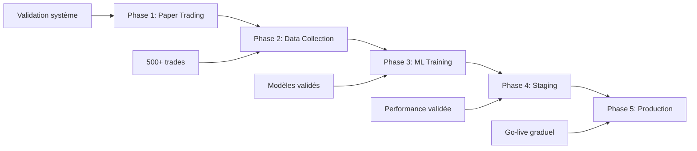

# Guide Déploiement Production - MIA_IA_SYSTEM

**Version: 3.0.0 - Architecture Automation**  
**Date: Juin 2025**

## 🎯 **INTRODUCTION**

Ce guide détaille le processus complet de déploiement du système MIA_IA_SYSTEM en production, de la validation paper trading jusqu'au live trading full automated. Le déploiement suit une approche **progressive et sécurisée** avec validation à chaque étape.

### **🏗️ Philosophie Déploiement**
```
📊 Validation : Paper → Data Collection → Staging → Production
🛡️ Sécurité : Conservative first, performance second
📈 Progressif : Capital croissant selon performance
🔄 Réversible : Rollback automatique si problème
⚡ Monitoring : Surveillance continue obligatoire
```

---

## 📋 **PHASES DE DÉPLOIEMENT**

### **Vue d'Ensemble des Phases**


### **Critères de Passage Entre Phases**
- **Phase 1 → 2** : 100+ signaux paper, 0 erreur système 24h
- **Phase 2 → 3** : 500+ trades collectés, qualité données >95%
- **Phase 3 → 4** : Modèles ML accuracy >65%, validation out-of-sample
- **Phase 4 → 5** : Performance staging positive 7 jours
- **Production** : Monitoring continu, capital progressif

---

## 🧪 **PHASE 1 : PAPER TRADING VALIDATION**

### **1.1 Objectifs Phase 1**
- Validation complète système automation
- Test SignalGenerator + BattleNavaleAnalyzer
- Validation SimpleBattleNavaleTrader
- Zero erreur système sur 24h minimum

### **1.2 Configuration Paper Trading**
```python
# Configuration conservative pour validation
from config.automation_config import create_paper_trading_config

config = create_paper_trading_config()
config.trading.automation_mode = AutomationMode.PAPER_TRADING
config.trading.max_positions_concurrent = 1     # Une position max
config.trading.battle_navale_min_confidence = 0.70  # Seuil élevé

# IBKR Paper Trading
config.ibkr.port = 7497                      # Port paper trading
config.ibkr.market_data_type = 3             # Delayed data
config.ibkr.client_id = 1                    # Client ID paper

# Monitoring renforcé
config.monitoring.detailed_logging = True
config.monitoring.alert_on_system_error = True
config.monitoring.performance_update_frequency = 30  # 30s
```

### **1.3 Démarrage Paper Trading**
```bash
# 1. Validation environnement
python -c "
from config import validate_all_configs
validation = validate_all_configs()
print(f'Configs valides: {sum(validation.values())}/{len(validation)}')
assert all(validation.values()), 'Configuration invalide'
"

# 2. Test composants critiques
python -c "
from strategies.signal_generator import create_signal_generator
from core.battle_navale import create_battle_navale_analyzer
from execution.simple_trader import SimpleBattleNavaleTrader

generator = create_signal_generator()
analyzer = create_battle_navale_analyzer()
trader = SimpleBattleNavaleTrader()

print('✅ SignalGenerator opérationnel')
print('✅ BattleNavaleAnalyzer opérationnel')
print('✅ SimpleBattleNavaleTrader opérationnel')
"

# 3. Démarrage automation paper trading
python automation_main.py --mode paper_trading --duration 24h --monitor
```

### **1.4 Métriques de Validation Phase 1**
```python
# Critères de réussite Phase 1
VALIDATION_CRITERIA_PHASE1 = {
    'signals_generated': {'min': 100, 'target': 200},
    'system_uptime': {'min': 99.5, 'target': 100.0},  # %
    'signal_latency_avg': {'max': 10.0, 'target': 5.0},  # ms
    'error_rate': {'max': 0.1, 'target': 0.0},  # %
    'consecutive_hours_stable': {'min': 24, 'target': 48},
    'battle_navale_accuracy': {'min': 60.0, 'target': 70.0},  # %
    'confluence_correlation': {'min': 0.6, 'target': 0.8}
}

# Validation automatique
python -c "
from execution.simple_trader import SimpleBattleNavaleTrader
from monitoring.performance_tracker import PerformanceTracker

trader = SimpleBattleNavaleTrader()
tracker = PerformanceTracker()

metrics = tracker.get_24h_metrics()
print(f'Signaux générés: {metrics[\"signals_count\"]}')
print(f'Uptime: {metrics[\"uptime_percent\"]:.1f}%')
print(f'Erreurs: {metrics[\"error_count\"]}')
print(f'Latence moyenne: {metrics[\"avg_latency_ms\"]:.1f}ms')

# Validation passage Phase 2
ready_for_phase2 = all([
    metrics['signals_count'] >= 100,
    metrics['uptime_percent'] >= 99.5,
    metrics['error_count'] == 0,
    metrics['avg_latency_ms'] <= 10.0
])

print(f'Prêt pour Phase 2: {\"✅\" if ready_for_phase2 else \"❌\"}')
"
```

---

## 📊 **PHASE 2 : DATA COLLECTION INTENSIVE**

### **2.1 Objectifs Phase 2**
- Collection 500-1000 trades via TradeSnapshotter
- Validation qualité données >95%
- Préparation datasets ML-ready
- Test performance système sous charge

### **2.2 Configuration Data Collection**
```python
# Configuration optimisée pour collection massive
from config.automation_config import create_data_collection_config

config = create_data_collection_config()
config.trading.automation_mode = AutomationMode.DATA_COLLECTION

# Seuils ajustés pour plus de trades
config.trading.battle_navale_min_confidence = 0.55  # Abaissé pour volume
config.trading.enable_confluence_validation = True   # Maintenu pour qualité

# Data collection maximisée
config.data_collection.enable_detailed_snapshots = True
config.data_collection.collect_ml_features = True
config.data_collection.collect_battle_navale_context = True
config.data_collection.snapshot_frequency = DataGranularity.TRADE_ONLY

# Target trades
config.trading.target_trades_per_session = 500
config.trading.max_session_duration_hours = 168  # 1 semaine max
```

### **2.3 Démarrage Data Collection**
```bash
# 1. Validation config data collection
python -c "
from config.automation_config import get_automation_config
config = get_automation_config()
print(f'Mode: {config.trading.automation_mode}')
print(f'Target trades: {config.trading.target_trades_per_session}')
print(f'Collection détaillée: {config.data_collection.enable_detailed_snapshots}')
"

# 2. Démarrage collection intensive
python automation_main.py --mode data_collection --target-trades 500 --monitor

# 3. Monitoring temps réel
watch -n 30 'curl -s http://localhost:8080/api/data/collection_status | jq .'
```

### **2.4 Monitoring Data Collection**
```python
# Surveillance quotidienne
DATA_COLLECTION_MONITORING = {
    'snapshots_per_day': {'target': 50, 'max': 200},
    'data_quality_score': {'min': 95.0, 'target': 98.0},
    'trades_completion_rate': {'min': 90.0, 'target': 95.0},
    'ml_features_completeness': {'min': 95.0, 'target': 100.0},
    'storage_growth_mb_per_day': {'max': 500, 'alert': 1000},
    'battle_navale_pattern_diversity': {'min': 3, 'target': 8}
}

# Check quotidien automatisé
python -c "
from execution.trade_snapshotter import TradeSnapshotter
snapshotter = TradeSnapshotter()

stats = snapshotter.get_collection_stats()
quality = snapshotter.get_quality_score()

print(f'Trades collectés: {stats[\"completed_trades\"]}')
print(f'Qualité données: {quality:.1f}%')
print(f'Snapshots ML-ready: {stats[\"ml_ready_snapshots\"]}')

# Validation passage Phase 3
ready_for_phase3 = (
    stats['completed_trades'] >= 500 and
    quality >= 95.0 and
    stats['ml_ready_snapshots'] >= 450
)

print(f'Prêt pour Phase 3: {\"✅\" if ready_for_phase3 else \"❌\"}')
"
```

---

## 🧠 **PHASE 3 : ML TRAINING & VALIDATION**

### **3.1 Objectifs Phase 3**
- Training modèles ML avec données collectées
- Validation performance out-of-sample
- Configuration pipeline ML automatique
- Préparation modèles staging

### **3.2 Training Modèles Initiaux**
```bash
# 1. Validation données training
python scripts/train_models.py --status --detailed

# 2. Training modèle initial Battle Navale
python scripts/train_models.py --train --mode initial --data-source snapshots --days 30

# 3. Validation rigoureuse
python scripts/train_models.py --train --mode initial --validation rigorous

# 4. Training modèles multiples pour comparaison
python scripts/train_models.py --train --model-type signal_classifier --validation comprehensive
python scripts/train_models.py --train --model-type profitability_predictor --validation rigorous
```

### **3.3 Validation Performance ML**
```python
# Critères validation modèles ML
ML_VALIDATION_CRITERIA = {
    'model_accuracy': {'min': 65.0, 'target': 70.0},
    'precision': {'min': 60.0, 'target': 68.0},
    'recall': {'min': 60.0, 'target': 65.0},
    'f1_score': {'min': 62.0, 'target': 67.0},
    'out_of_sample_performance': {'min': 60.0, 'target': 65.0},
    'model_stability': {'min': 90.0, 'target': 95.0},  # Cross-validation
    'overfitting_score': {'max': 10.0, 'target': 5.0},  # %
    'feature_importance_battle_navale': {'min': 60.0, 'target': 80.0}  # %
}

# Validation automatique modèles
python -c "
from ml.model_trainer import create_battle_navale_trainer

trainer = create_battle_navale_trainer()
status = trainer.get_training_status()

if status['active_model']:
    model = status['active_model']
    print(f'Modèle actif: {model[\"version_id\"]}')
    print(f'Accuracy: {model[\"accuracy\"]:.3f}')
    print(f'F1-Score: {model[\"f1_score\"]:.3f}')
    
    # Validation critères
    ready_for_staging = (
        model['accuracy'] >= 0.65 and
        model['f1_score'] >= 0.62 and
        model['training_samples'] >= 400
    )
    
    print(f'Prêt pour staging: {\"✅\" if ready_for_staging else \"❌\"}')
else:
    print('❌ Aucun modèle actif')
"
```

### **3.4 Configuration ML Production**
```python
# Configuration ML pour production
from config.ml_config import create_production_ml_config

ml_config = create_production_ml_config()
ml_config.ml_enabled = True
ml_config.model.min_accuracy = 0.70                    # Standards élevés
ml_config.deployment.auto_deploy_enabled = False       # Déploiement manuel
ml_config.deployment.staging_period_hours = 48         # Test staging 48h
ml_config.automation_integration.signal_weight_in_decision = 0.25  # 25% ML, 75% Battle Navale

# Sauvegarde config production
ml_config.save_to_file("config/ml_production_config.json")
```

---

## 🏗️ **PHASE 4 : STAGING ENVIRONMENT**

### **4.1 Objectifs Phase 4**
- Test modèles ML en environnement staging
- Validation performance combinée Battle Navale + ML
- Test déploiement et rollback procedures
- Validation monitoring production

### **4.2 Configuration Staging**
```python
# Configuration staging complète
from config.automation_config import create_conservative_config

staging_config = create_conservative_config()
staging_config.environment = "staging"
staging_config.trading.automation_mode = AutomationMode.PAPER_TRADING  # Paper mais réaliste

# ML en staging
staging_config.ml.ml_enabled = True
staging_config.ml.auto_training_enabled = False
staging_config.ml.ml_signal_weight = 0.20              # 20% ML en staging
staging_config.ml.fallback_to_battle_navale = True     # Sécurité

# Monitoring staging renforcé
staging_config.monitoring.enable_live_monitoring = True
staging_config.monitoring.alert_email = "staging@votre-domaine.com"
staging_config.monitoring.performance_update_frequency = 15  # 15s
staging_config.monitoring.alert_on_ml_degradation = True
```

### **4.3 Déploiement Staging**
```bash
# 1. Setup environnement staging
python -c "
from config import setup_configs_for_environment
setup_configs_for_environment('staging')
print('✅ Environnement staging configuré')
"

# 2. Déploiement modèle en staging
python scripts/train_models.py --deploy version_id --environment staging

# 3. Démarrage système staging
python automation_main.py --mode paper_trading --config staging --duration 7d --monitor

# 4. Monitoring staging
python -c "
from monitoring.live_monitor import LiveMonitor
monitor = LiveMonitor()
monitor.start_staging_monitoring()
"
```

### **4.4 Validation Performance Staging**
```python
# Métriques validation staging
STAGING_VALIDATION_METRICS = {
    'combined_performance': {
        'battle_navale_alone': 'baseline',
        'battle_navale_plus_ml': {'improvement_min': 5.0},  # 5% min
        'ml_contribution': {'positive': True, 'significance': 0.05}
    },
    'system_stability': {
        'uptime_7_days': {'min': 99.0, 'target': 99.5},
        'ml_model_stability': {'min': 95.0, 'target': 98.0},
        'fallback_triggers': {'max': 2, 'target': 0}
    },
    'risk_metrics': {
        'max_drawdown': {'max': 5.0, 'target': 3.0},
        'sharpe_ratio': {'min': 1.0, 'target': 1.5},
        'win_rate': {'min': 55.0, 'target': 65.0}
    }
}

# Validation staging automatique
python -c "
from monitoring.performance_tracker import PerformanceTracker
tracker = PerformanceTracker()

staging_metrics = tracker.get_staging_performance(days=7)
print(f'Performance 7 jours:')
print(f'  Battle Navale seul: {staging_metrics[\"battle_navale_only_return\"]:.2f}%')
print(f'  Battle Navale + ML: {staging_metrics[\"combined_return\"]:.2f}%')
print(f'  Amélioration ML: {staging_metrics[\"ml_improvement\"]:.2f}%')
print(f'  Drawdown max: {staging_metrics[\"max_drawdown\"]:.2f}%')

ready_for_production = (
    staging_metrics['ml_improvement'] >= 5.0 and
    staging_metrics['max_drawdown'] <= 5.0 and
    staging_metrics['uptime_percent'] >= 99.0
)

print(f'Prêt pour Production: {\"✅\" if ready_for_production else \"❌\"}')
"
```

---

## 🚀 **PHASE 5 : PRODUCTION DEPLOYMENT**

### **5.1 Objectifs Phase 5**
- Déploiement live trading progressif
- Capital croissant selon performance
- Monitoring continu 24/7
- Performance tracking et optimisation

### **5.2 Configuration Production**
```python
# Configuration production ultra-sécurisée
from config.automation_config import create_conservative_config

prod_config = create_conservative_config()
prod_config.environment = "production"
prod_config.trading.automation_mode = AutomationMode.LIVE_TRADING

# IBKR Live
prod_config.ibkr.port = 7496                           # Live trading
prod_config.ibkr.market_data_type = 1                  # Live data
prod_config.ibkr.client_id = 2                         # Live client ID

# Risk ultra-conservateur
prod_config.risk.daily_loss_limit = 200.0              # Start conservateur
prod_config.risk.max_risk_per_trade = 50.0             # Risk limité
prod_config.trading.max_positions_concurrent = 1       # Une position

# ML conservateur
prod_config.ml.ml_enabled = True
prod_config.ml.ml_signal_weight = 0.15                 # 15% ML seulement
prod_config.ml.auto_deploy_if_better = False           # Déploiement manuel
prod_config.ml.fallback_to_battle_navale = True        # Sécurité max

# Monitoring production
prod_config.monitoring.enable_alerts = True
prod_config.monitoring.alert_email = "prod@votre-domaine.com"
prod_config.monitoring.alert_on_loss_streak = 1        # Alerte dès 1 perte
prod_config.monitoring.monitoring_frequency_seconds = 5 # 5s monitoring
```

### **5.3 Déploiement Production Progressif**

#### **Phase 5.1 : Micro Capital (0.5% compte)**
```bash
# Capital initial très réduit
python -c "
from config.automation_config import get_automation_config
config = get_automation_config()
config.trading.position_size_base = 0.5    # 50% taille normale
config.risk.daily_loss_limit = 100.0       # $100 max/jour
config.save_to_file('config/prod_micro.json')
"

# Démarrage micro production
python automation_main.py --mode live_trading --config prod_micro.json --duration 7d
```

#### **Phase 5.2 : Capital Normal (1% compte)**
```bash
# Après 7 jours positifs
python -c "
config.trading.position_size_base = 1.0    # Taille normale
config.risk.daily_loss_limit = 200.0       # $200 max/jour
config.save_to_file('config/prod_normal.json')
"

python automation_main.py --mode live_trading --config prod_normal.json
```

#### **Phase 5.3 : Capital Progressif (jusqu'à 2% compte)**
```bash
# Après 1 mois positif
python -c "
config.trading.position_size_base = 2.0    # Taille augmentée
config.risk.daily_loss_limit = 400.0       # $400 max/jour
config.trading.max_positions_concurrent = 2 # Deux positions max
config.save_to_file('config/prod_scaled.json')
"
```

### **5.4 Monitoring Production 24/7**
```bash
# Dashboard production temps réel
python -c "
from monitoring.live_monitor import LiveMonitor
monitor = LiveMonitor()
monitor.start_production_monitoring()
"

# APIs monitoring
curl http://localhost:8080/api/production/status
curl http://localhost:8080/api/production/performance
curl http://localhost:8080/api/production/risk_metrics

# Alertes automatiques
python -c "
from monitoring.alert_system import AlertSystem
alerts = AlertSystem()
alerts.setup_production_alerts()
alerts.test_all_channels()
"
```

---

## 🛡️ **SÉCURITÉ & MONITORING PRODUCTION**

### **6.1 Kill Switch Automatique**
```python
# Configuration kill switch production
KILL_SWITCH_TRIGGERS = {
    'daily_loss_exceeded': {
        'threshold': 100.0,        # % de daily_loss_limit
        'action': 'immediate_stop'
    },
    'consecutive_losses': {
        'threshold': 3,
        'action': 'pause_trading_1h'
    },
    'ml_model_failure': {
        'threshold': 'any_error',
        'action': 'fallback_battle_navale_only'
    },
    'system_error_rate': {
        'threshold': 5.0,          # % erreurs/heure
        'action': 'pause_trading_30min'
    },
    'connection_lost': {
        'threshold': 60,           # secondes
        'action': 'emergency_stop'
    }
}

# Test kill switch
python -c "
from execution.simple_trader import SimpleBattleNavaleTrader
trader = SimpleBattleNavaleTrader()
trader.test_kill_switch_all_triggers()
print('✅ Kill switch opérationnel')
"
```

### **6.2 Backup et Recovery**
```bash
# Backup quotidien automatique
0 2 * * * python -c "
from execution.trade_snapshotter import TradeSnapshotter
snapshotter = TradeSnapshotter()
snapshotter.backup_all_production_data()
"

# Recovery procedure test
python -c "
from execution.simple_trader import SimpleBattleNavaleTrader
trader = SimpleBattleNavaleTrader()
recovery_status = trader.test_recovery_procedures()
print(f'Recovery test: {recovery_status}')
"
```

### **6.3 Performance Tracking Production**
```python
# Métriques production critiques
PRODUCTION_KPIs = {
    'financial': {
        'daily_pnl': 'tracked_realtime',
        'monthly_return': 'target_positive',
        'max_drawdown': 'never_exceed_5_percent',
        'sharpe_ratio': 'target_above_1.0'
    },
    'system': {
        'uptime': 'target_99.9_percent',
        'signal_latency': 'always_below_10ms',
        'execution_slippage': 'average_below_1_tick',
        'error_rate': 'always_below_0.1_percent'
    },
    'ml': {
        'model_accuracy': 'monitored_continuous',
        'ml_contribution': 'tracked_vs_baseline',
        'model_degradation': 'alert_if_5_percent_drop',
        'fallback_frequency': 'minimize'
    }
}

# Rapport production quotidien
python -c "
from monitoring.performance_tracker import PerformanceTracker
tracker = PerformanceTracker()

daily_report = tracker.generate_production_report()
print(f'P&L aujourd\\'hui: ${daily_report[\"daily_pnl\"]:.2f}')
print(f'Trades exécutés: {daily_report[\"trades_count\"]}')
print(f'Win rate: {daily_report[\"win_rate\"]:.1f}%')
print(f'Drawdown actuel: {daily_report[\"current_drawdown\"]:.2f}%')
print(f'Uptime: {daily_report[\"uptime_percent\"]:.2f}%')

# Envoi rapport par email
tracker.send_daily_report_email()
"
```

---

## 📊 **ROLLBACK ET CONTINGENCY**

### **7.1 Procédures Rollback Automatique**
```python
# Triggers rollback automatique
ROLLBACK_TRIGGERS = {
    'performance_degradation': {
        'metric': 'daily_return_vs_baseline',
        'threshold': -10.0,        # 10% sous baseline
        'duration': '3_consecutive_days'
    },
    'ml_model_instability': {
        'metric': 'prediction_confidence_drop',
        'threshold': 20.0,         # 20% drop confiance
        'duration': '4_hours'
    },
    'system_errors_spike': {
        'metric': 'error_rate_increase',
        'threshold': 500.0,        # 500% increase
        'duration': '1_hour'
    }
}

# Test rollback
python -c "
from execution.simple_trader import SimpleBattleNavaleTrader
trader = SimpleBattleNavaleTrader()

# Simulation rollback
rollback_result = trader.test_rollback_to_battle_navale_only()
print(f'Rollback test: {rollback_result[\"success\"]}')
print(f'Temps rollback: {rollback_result[\"duration_ms\"]}ms')
"
```

### **7.2 Plans de Contingence**
```bash
# Plan A : Rollback ML seulement
python -c "
trader.disable_ml_enhancement()
trader.continue_battle_navale_only()
"

# Plan B : Pause trading temporaire
python -c "
trader.pause_trading(duration_hours=2)
trader.enable_monitoring_only()
"

# Plan C : Arrêt complet
python automation_main.py --emergency-stop --close-all-positions
```

---

## ✅ **CHECKLIST DÉPLOIEMENT COMPLET**

### **Phase 1 : Paper Trading ✓**
- [ ] ✅ 100+ signaux générés sans erreur
- [ ] ✅ Uptime >99.5% sur 24h
- [ ] ✅ Latence SignalGenerator <10ms
- [ ] ✅ BattleNavaleAnalyzer accuracy >60%

### **Phase 2 : Data Collection ✓**
- [ ] ✅ 500+ trades collectés
- [ ] ✅ Qualité données >95%
- [ ] ✅ TradeSnapshotter opérationnel
- [ ] ✅ Features ML complètes

### **Phase 3 : ML Training ✓**
- [ ] ✅ Modèles accuracy >65%
- [ ] ✅ Validation out-of-sample
- [ ] ✅ Performance stable
- [ ] ✅ Pipeline ML automatique

### **Phase 4 : Staging ✓**
- [ ] ✅ Performance Battle Navale + ML >5% vs baseline
- [ ] ✅ Système stable 7 jours
- [ ] ✅ Monitoring production opérationnel
- [ ] ✅ Procédures rollback testées

### **Phase 5 : Production ✓**
- [ ] ✅ Déploiement micro capital réussi
- [ ] ✅ Kill switch opérationnel
- [ ] ✅ Monitoring 24/7 actif
- [ ] ✅ Performance positive constante

---

## 🎯 **COMMANDES DEPLOYMENT ESSENTIELLES**

### **Validation Pré-Déploiement**
```bash
# Check complet système
python -c "
from config import validate_all_configs, get_config_summary
validation = validate_all_configs()
summary = get_config_summary()
print(f'Validation: {sum(validation.values())}/{len(validation)} ✅')
print(f'Environnement: {summary[\"environment\"]}')
"

# Test tous composants
python -c "
from strategies import test_signal_generator
from core import test_battle_navale_analyzer
from execution import test_simple_trader
from ml import test_ml_module

test_signal_generator()
test_battle_navale_analyzer()
test_simple_trader()
test_ml_module()
print('✅ Tous composants opérationnels')
"
```

### **Déploiement Progressive**
```bash
# Phase 1 : Paper
python automation_main.py --mode paper_trading --duration 24h

# Phase 2 : Data Collection
python automation_main.py --mode data_collection --target-trades 500

# Phase 3 : ML Training
python scripts/train_models.py --train --mode initial --validation rigorous

# Phase 4 : Staging
python automation_main.py --mode paper_trading --config staging --duration 7d

# Phase 5 : Production Micro
python automation_main.py --mode live_trading --config conservative --capital micro
```

### **Monitoring Production**
```bash
# Status système temps réel
curl http://localhost:8080/api/production/status

# Performance dashboard
curl http://localhost:8080/dashboard

# Logs monitoring
tail -f logs/production/live_trading.log
tail -f logs/production/alerts.log
```

---

**🚀 Votre système MIA_IA_SYSTEM est maintenant prêt pour un déploiement production progressif et sécurisé !**

*Guide maintenu par l'équipe MIA_IA_SYSTEM - Version 3.0.0 - Déploiement Production*