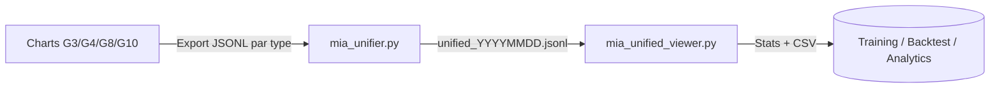

# 📄 Guide d'utilisation – MIA Unified System

Ce document décrit le fonctionnement et l’utilisation des deux outils clés pour la consolidation et l’analyse des flux Sierra Chart :

- **`mia_unifier.py`** : script d’unification et de consolidation des fichiers exportés par chart/type.
- **`mia_unified_viewer.py`** : viewer/analyste qui inspecte les fichiers unifiés et génère des rapports.

---

## 1. Contexte

Après refonte de l’architecture de collecte, chaque chart (G3, G4, G8, G10) exporte ses propres fichiers JSONL spécialisés :

- **Chart 3 (1m)** : `basedata`, `depth`, `quote/trade`, `vwap`, `vva`, `pvwap`, `nbcv`.
- **Chart 4 (30m)** : `ohlc`, `vwap`, `pvwap`, `nbcv`.
- **Chart 8** : `vix`.
- **Chart 10** : `menthorq_level`.

Ces fichiers sont ensuite regroupés dans un flux unifié pour faciliter les backtests, l’entraînement IA et les analyses.

---

## 2. `mia_unifier.py` – Consolidation batch

### 📌 Rôle
Unifie tous les fichiers `chart_<num>_<type>_<YYYYMMDD>.jsonl` d’une journée en un seul flux **cohérent, dédupliqué et aligné dans le temps**.

### 🔑 Fonctions principales
- **Bucketisation temporelle** : groupement des évènements avec tolérance (défaut `0.2s`).
- **Déduplication & fusion** : garde la dernière valeur pertinente par type.
- **Sanity checks** :
  - VVA réordonné (VAH ≥ VPOC ≥ VAL).
  - VWAP bands corrigées (up ≥ dn).
- **DOM** : conserve un maximum de N niveaux par côté (défaut 20).

### ⚙️ Options principales
```bash
--indir <path>      # Dossier d'entrée (ex: D:\MIA_IA_system)
--date <YYYYMMDD>   # Date (ou 'today')
--out <file>        # Fichier sortie (sinon unified_<date>.jsonl)
--tol <float>       # Tolérance temps en secondes (défaut 0.2)
--max_depth_levels  # Niveaux DOM conservés (défaut 20)
--menthorq-filter   # Active le filtre MenthorQ (si dispo)
--only vwap,vva,... # Inclut seulement certains blocs
--gzip              # Sortie compressée (.jsonl.gz)
--verbose           # Log détaillé
```

### 💡 Exemples
```bash
# Consolidation standard
python mia_unifier.py --indir "D:\MIA_IA_system" --date today

# Sortie gzip + filtre MenthorQ
python mia_unifier.py --indir "D:\MIA_IA_system" --date today --gzip --menthorq-filter

# Unifier uniquement vwap/vva/vix + depth
python mia_unifier.py --indir "D:\MIA_IA_system" --date 20250910 --only vwap,vva,vix,depth
```

---

## 3. `mia_unified_viewer.py` – Analyse et reporting

### 📌 Rôle
Inspecte un fichier unifié (`.jsonl` ou `.jsonl.gz`) et produit :
- Statistiques globales.
- Vérifications de cohérence (VWAP/VVA, NBCV).
- Répartition MenthorQ.
- Export CSV optionnel.

### 🔑 Fonctions principales
- **Stats globales** : nb de buckets, blocs présents, profondeur DOM moyenne/max.
- **Détection anomalies** :
  - VVA hors ordre (VAH ≥ VPOC ≥ VAL).
  - VWAP inversé (up < dn).
  - NBCV incomplet (footprint/metrics/orderflow manquants).
- **MenthorQ** : distribution par SG.
- **Exports CSV** : `vwap.csv`, `vva.csv`, `vix.csv`, `depth_summary.csv`, `run_stats.csv`.

### ⚙️ Options principales
```bash
--file <file>    # Fichier unified à analyser (.jsonl ou .jsonl.gz)
--limit <N>      # Limiter le nombre de lignes lues (tests rapides)
--csv-out <dir>  # Répertoire où écrire les CSVs
--quiet          # Réduit la verbosité
```

### 💡 Exemples
```bash
# Rapport JSON à l’écran
python mia_unified_viewer.py --file "D:\MIA_IA_system\unified_20250910.jsonl.gz"

# Limiter à 10k lignes
python mia_unified_viewer.py --file "D:\MIA_IA_system\unified_20250910.jsonl" --limit 10000

# Export CSVs dans un dossier
python mia_unified_viewer.py --file "D:\MIA_IA_system\unified_20250910.jsonl.gz" --csv-out "D:\MIA_IA_system\reports"
```

---

## 4. Workflow recommandé
1. **Collecte multi-chart** via dumpers spécialisés.
2. **Unification batch** avec `mia_unifier.py` (fin de session ou toutes les X minutes).
3. **Inspection/QA** avec `mia_unified_viewer.py` (statistiques, anomalies, CSVs).
4. **Exploitation** des fichiers `unified_YYYYMMDD.jsonl(.gz)` comme source unique pour backtests, IA et reporting.

---

## 5. Résumé visuel


---

## 6. Bonnes pratiques
- **Planifier** l’unification chaque soir (cron/Task Scheduler).
- **Tolérance (`--tol`)** : adapter selon la granularité (0.2s = bon compromis).
- **Rétention** : garder sources par chart 30 jours, unified 90 jours.
- **QA régulière** : utiliser le viewer pour détecter tôt des anomalies (VWAP inversé, NBCV incomplet, flux VIX absent).

